# Đại Cương Thẩm Định & Tối Ưu（STORY_ARCS）

> Thẩm định: Tổng biên tập mô hình gemini（Tác giả: agy）
> Thời gian: 2026-09-05T17:04:00.684Z

# PHẦN 1: BÁO CÁO THẨM ĐỊNH & ĐÁNH GIÁ CHẤT LƯỢNG

- [Lỗi nghiêm trọng] Đánh số phân quyển và phân bổ chương bị đứt gãy: Dàn ý STORY_ARCS.md bỏ sót hoàn toàn Quyển 5 (Ch.195–207), sau đó đánh số thụt lùi thành "Quyển 2 (Ch.208–230)" và "Quyển 3 (Ch.231–270)", rồi nhảy cóc đè số chương từ Quyển 3 lên Quyển 7 (Ch.0261–0340) làm mất hẳn Quyển 5 và Quyển 6 → Tái thiết lập hệ thống 10 Phân Quyển chuẩn mực từ Chương 0001 đến 0600, xác định dải Ch.208–232 là Quyển 6 và phân chia dải chương tịnh tiến không trùng lặp.
- [Lỗi nghiêm trọng] Mục Xuất Vân Đế Quốc bị rơi rụng tiêu đề và thụt lùi cảnh giới: Đoạn văn về Xuất Vân đứng lơ lửng sau Quyển 3 và ghi lùi cảnh giới Lục Trần thành "Đấu Linh đỉnh phong ➔ Đột phá Đấu Vương" trong khi trước đó đã đạt Đấu Vương 5★ → Định danh chính thức thành Quyển 8 (Ch.276–330): Vạn Độc Xuất Vân, chuẩn hóa mốc tu vi Lục Trần là "Đấu Vương 5★ ➔ Đấu Hoàng 2★" để bảo đảm tính logic với tiến trình giải cứu Tiểu Y Tiên.
- [Lỗi nghiêm trọng] Xung đột thiết lập cốt lõi về Dị Hỏa ở Quyển 7 và Quyển 9: Đề xuất Lục Trần "thu phục Tam Thiên Diễm Viêm Hỏa" và "thu phục Tịnh Liên Yêu Hỏa" theo lối mòn luyện hóa vào cơ thể, vi phạm tôn chỉ "Thuộc tính Thủy độc tôn, không tu Phần Quyết" của `novel_bible.md` → Chuyển đổi toàn diện cơ chế sang Trận Khí Sư Thủy Hệ: Vận dụng quy luật Thủy Hỏa tương sinh / Âm Dương trận đạo để phong ấn Dị Hỏa làm Trận Nhãn chí tôn, rút Tinh Hạch Long Hồn tôi luyện Thập Bát Diệp Kiếm Trận chứ không hấp thu dị hỏa vào kinh mạch.
- [Lỗi nghiêm trọng] Phá vỡ hình tượng túc địch kiêu hùng với Tiêu Viêm ở Quyển 10: Xây dựng tình tiết "Lục Trần liên thủ Tiêu Viêm... cùng Viêm Đế song hùng bình định hắc ám", rơi vào lối mòn huynh đệ đồng minh sáo rỗng, OOC hoàn toàn với thiết lập "Túc địch kiêu hùng, cạnh tranh sinh tồn lạnh lùng" → Định vị lại thành thế chân vạc kiêu hùng độc lập: Hai bên duy trì thế lực riêng (Hàn Thủy Cung vs Tiêu Môn/Thiên Phủ Liên Minh), chỉ tạm thời đình chiến trước đại kiếp diệt thế của Hồn Tộc vì sinh tồn đại cục, cuối cùng phân định trật tự đại lục giữa Kiếm Trận Chí Tôn và Viêm Đế.
- [Nguy cơ tiềm ẩn] Nguy cơ tụt áp nhịp điệu sau cao trào Vân Lam Sơn (Ch.223–228): Sau khi chém Vân Sơn và đánh lui Vụ Hộ Pháp, mạch truyện có nguy cơ chùng xuống nếu chỉ tập trung đàm phán kinh tế và tiếp quản tài nguyên thủy mạch một cách hành chính → Duy trì áp lực phản kích quân sự từ Đấu Hoàng Vân Hám cùng tử sĩ tàn dư Vân Lam Tông tại Trấn Ma Quan biên giới, biến quá trình đột phá Đấu Vương và sáng lập Thiên Thương Kiếm Các thành đòn bẩy quân sự nghẹt thở.
- [Nguy cơ tiềm ẩn] Quy tắc Luyện Khí phi kim loại dễ bị lơ là: Các phân đoạn rèn kiếm và thăng cấp Thủy Vân Thuyền ở các quyển sau có thể vô tình đưa kim loại vào nếu thiếu kiểm soát → Cố định tuyệt đối nguyên tắc vật liệu thép: Chỉ dùng Hải Tâm Thạch, Thủy Ngọc, Băng Tinh và Xương Ma Thú nén bằng Thủy Áp, cấm tiệt việc rèn đúc kim loại sắt thép.
- [Gợi ý] Nâng tầm thủ đoạn đối đầu mưu lược với Tiêu Môn ở Quyển 7: Nên đẩy mạnh chiến tranh tài chính gián tiếp thông qua mạng lưới thương hội của Nhã Phi và bẫy đấu giá tại Thiên Nhai Thành, tạo sảng điểm đấu trí lạnh lùng đặc sắc mang đậm phong vị Hardboiled.
- [Gợi ý] Lộ trình thu hồi 7 đại phục bút (HOOK-01 đến HOOK-07): Cần phân bổ việc thu hồi các mắt xích rải đều qua từng quyển (HOOK-03 tại Quyển 6–7; HOOK-01 tại Quyển 8; HOOK-02, 04, 06 tại Quyển 9–10) để bảo đảm mạch ngầm trường thiên vững chắc.

【Đánh giá tổng thể】 Cần sửa lại rồi mới viết —— Dàn ý hiện tại bị đứt gãy phân quyển, nhảy số chương, thụt lùi cảnh giới và OOC quan hệ túc địch với Tiêu Viêm, cần được tái cấu trúc toàn diện theo trục 10 quyển chuẩn xác.

---

# PHẦN 2: BẢN DÀN Ý TỐI ƯU HOÀN THIỆN NHẤT
## (PROPOSED OPTIMIZED OUTLINE — STORY ARCS)

---

## I. KHUNG TRỤC ĐẠI CƯƠNG PHÂN QUYỂN TOÀN THƯ (10 QUYỂN CHUẨN: CHƯƠNG 0001 – 0600)

```mermaid
graph LR
    Q1["Q1: Ô Thản Phong Lôi<br/>(Ch.001-051)"] --> Q2["Q2: Sa Mạc Kỳ Duyên<br/>(Ch.052-088)"]
    Q2 --> Q3["Q3: Già Nam Tâm Hỏa<br/>(Ch.089-137)"]
    Q3 --> Q4["Q4: Cổ Trận Thiên Cung<br/>(Ch.138-194)"]
    Q4 --> Q5["Q5: Hàn Thủy Khai Tông<br/>(Ch.195-207)"]
    Q5 --> Q6["Q6: Kiếm Phúc Vân Lam<br/>(Ch.208-232)"]
    Q6 --> Q7["Q7: Phong Khởi Hắc Giác<br/>(Ch.233-275)"]
    Q7 --> Q8["Q8: Vạn Độc Xuất Vân<br/>(Ch.276-330)"]
    Q8 --> Q9["Q9: Kiếm Chấn Tinh Vực<br/>(Ch.331-440)"]
    Q9 --> Q10["Q10: Vạn Cổ Trận Thần<br/>(Ch.441-600)"]
```

### 🔹 QUYỂN 1: HÀN VI SƠ KHỞI · Ô THẢN PHONG LÔI (CHƯƠNG 0001 – 0051) — [ĐÃ HOÀN THÀNH]
* **Bối cảnh:** Ô Thản Thành ➔ Trấn Thanh Sơn ➔ Ma Thú Sơn Mạch ➔ Tuyển bạt Già Nam.
* **Cảnh giới Lục Trần:** Đấu Chi Khí Cửu Đoạn ➔ Đấu Giả 1★ ➔ Đột phá Đấu Sư 1★.
* **Cốt lõi:** Khởi đầu hàn vi con thương nhân quặng Lục Thiết; thức tỉnh Thủy hệ độc tôn; Đầm Sương Mù đoạt liên hoa; Đấu giá Mễ Đặc Nhĩ gặp Nhã Phi; vào Ma Thú Sơn Mạch kết giao Tiểu Y Tiên, diệt Lang Đầu Dong Binh Đoàn; chia tay Tiểu Y Tiên dưới mưa; đỗ Già Nam Học Viện.

---

### 🔹 QUYỂN 2: HOÀNG ĐÔ ĐOẠT KHÔI · SA MẠC KỲ DUYÊN (CHƯƠNG 0052 – 0088) — [ĐÃ HOÀN THÀNH]
* **Bối cảnh:** Gia Mã Hoàng Đô ➔ Tháp Qua Nhĩ Sa Mạc (Thạch Mạc Thành, Lòng đất nham tương).
* **Cảnh giới Lục Trần:** Đấu Sư 1★ ➔ Đấu Sư 4★.
* **Cốt lõi:** Đoạt Quán Quân Đại Hội Luyện Dược Sư bằng bí thuật Thủy Hỏa tương tể; tiến vào sa mạc gặp Mạc Thiết Dong Binh Đoàn; cùng Tiêu Viêm thâm nhập lòng đất; Tiêu Viêm đoạt Thanh Liên Địa Tâm Hỏa, Lục Trần thu phục Cực Âm Cực Dương Tinh Dịch; thiết lập minh ước ngầm cứu sống Xà Nhân Tộc cùng Mỹ Đỗ Toa Nữ Vương.

---

### 🔹 QUYỂN 3: GIÀ NAM PHONG LÔI · TÂM HỎA THÔN THIÊN (CHƯƠNG 0089 – 0137) — [ĐÃ HOÀN THÀNH]
* **Bối cảnh:** Hòa Bình Trấn ➔ Nội Viện Già Nam ➔ Thiên Phần Luyện Khí Tháp ➔ Cường Bảng.
* **Cảnh giới Lục Trần:** Đấu Sư 5★ ➔ Đại Đấu Sư 2★ đỉnh phong.
* **Cốt lõi:** Đại phá Hắc Bạch Quan Sát; sáng tạo Điệp Khổng Thủy Áp và Cửu Mạch Thủy Kỳ tại Thiên Phần Luyện Khí Tháp; trảm sát Phạm Lăng đoạt Mảnh tàn đồ Tịnh Liên Yêu Hỏa số 3 (HOOK-02); tu thành Bích Ngọc Giáp; lọt Top 10 Cường Bảng; bạo loạn Vẫn Lạc Tâm Viêm bùng nổ, Lục Trần thủ viện rồi bị phong bạo không gian cuốn trôi dạt về Nam Hải.

---

### 🔹 QUYỂN 4: U UYÊN NAM HẢI · CỔ TRẬN THIÊN CUNG (CHƯƠNG 0138 – 0194) — [ĐÃ HOÀN THÀNH]
* **Bối cảnh:** Nam Đại Lục Hoang Dã ➔ Vạn Dặm Đại Ngàn ➔ Vạn Đảo Hải Dương Ma Trận ➔ Vực sâu Nghịch Nhiệt.
* **Cảnh giới Lục Trần:** Đại Đấu Sư 3★ ➔ Đột phá Đấu Linh 1★ – 2★.
* **Cốt lõi:** Kết giao Tử Linh (Đấu Tông 1★), nhận Ám Chi Ấn; thuần phục Tinh Á (Dị Hỏa #18); giải cứu mỹ nhân ngư Hải Âm; kế thừa Cổ Trận Thiên Cung: lĩnh ngộ Cổ Đạo Hàn Thủy, kiếm quyết Vạn Kiếm Quy Tông, công nghệ luyện khí phi kim loại; đúc Bích Hải Quy Linh Đàn (Dị Hỏa #13) tặng Hải Âm; rèn 18 thanh phi kiếm ngọc phách lập Thập Bát Diệp Kiếm Trận; chuyển hóa toàn diện thành Kiếm Tiên Thủy Hệ kiêm Trận Khí Sư.

---

### 🔹 QUYỂN 5: HÀN THỦY KHAI TÔNG · THẦN BINH HÀNG LÂM (CHƯƠNG 0195 – 0207) — [ĐÃ HOÀN THÀNH]
* **Bối cảnh:** Hắc Giác Vực (Bình nguyên Thủy Ngạc, Phong Thành) ➔ Gia Mã Hoàng Đô (Mễ Đặc Nhĩ trang viên).
* **Cảnh giới Lục Trần:** Đấu Linh 2★ đỉnh phong.
* **Cốt lõi:** Sáng lập Hàn Thủy Cung, di cư 12.000 Xà Nhân Tộc về Thủy Ngạc (HOOK-07); song tu cùng Tử Linh; trảm sát Ưng Lệ (Ch.204); đánh tan phân thân Vụ Hộ Pháp (Ch.205); đóng cự hạm Thủy Vân Thuyền vượt vạn dặm về Gia Mã; thần binh giáng lâm cứu Nhã Phi trong gang tấc, nghiền nát Đấu Hoàng Vân Đốc gãy xương ngực (Ch.207).

---

### 🔹 QUYỂN 6: KIẾM PHÚC VÂN LAM · CHẤN NHIẾP BIÊN QUAN (CHƯƠNG 0208 – 0232) — [ĐANG THỰC HIỆN]
* **Bối cảnh:** Gia Mã Hoàng Đô ➔ Tông môn Vân Lam Sơn ➔ Trấn Ma Quan biên giới.
* **Cảnh giới Lục Trần:** Đấu Linh 2★ đỉnh phong ➔ Đột phá Đấu Vương 1★.
* **Chủ đề & Mục tiêu:** Tiêu diệt Vân Lam Tông, trảm Vân Sơn; bức lui Vụ Hộ Pháp đoạt Huyết Ngọc Lệnh; thiết lập phân nhánh Thiên Thương Kiếm Các giao Nhã Phi; thâu tóm trọn vẹn mạch nước ngầm Gia Mã hoàn thành lời hứa với Xà Nhân; đột phá Đấu Vương ngưng tụ Thiên Thủy Kiếm Dực; trảm sát Đấu Hoàng Vân Hám trấn nhiếp biên quan.
* **Tuyến xung đột cốt lõi:** Liên quân Hàn Thủy Cung vs Vân Lam Tông & Vụ Hộ Pháp; sự rạn nứt đỉnh điểm và phân hóa lộ tuyến kiêu hùng với Tiêu Viêm.
* **Mốc biến cố then chốt:** Trảm Vân Sát, phế Vân Đốc (Ch.208); tổng công kích Vân Lam Sơn (Ch.211–215); chém cụt tay Vụ Hộ Pháp đoạt Huyết Ngọc Lệnh, Tiêu Viêm nuốt hận rút lui về Già Nam (Ch.218–221); thiết lập Thiên Thương Kiếm Các (Ch.223); đột phá Đấu Vương 1★ (Ch.227); huyết chiến Trấn Ma Quan trảm Đấu Hoàng Vân Hám (Ch.230).

---

### 🔹 QUYỂN 7: PHONG KHỞI HẮC GIÁC · CỔ TRẬN TRANH HÙNG (CHƯƠNG 0233 – 0275) — [KẾ HOẠCH]
* **Bối cảnh:** Hắc Giác Vực (Bình nguyên Thủy Ngạc, Thiên Nhai Thành, Đoạn Hồn Cốc).
* **Cảnh giới Lục Trần:** Đấu Vương 1★ ➔ Đấu Vương 5★.
* **Chủ đề & Mục tiêu:** Khẳng định vị thế chí tôn Hàn Thủy Cung tại Hắc Giác Vực; thăng cấp Tam Cấp Cửu Khúc Thủy Long Trận; khai mở tầng 2 Cổ Trận Thiên Cung (HOOK-04).
* **Tuyến xung đột cốt lõi:** Chiến tranh tài chính và đoạt bảo ngầm giữa Hàn Thủy Cung vs Tiêu Môn (Tiêu Viêm chỉ đạo từ xa) & Tàn dư Liên minh Hắc Minh.
* **Mốc biến cố then chốt:** Đại hội đấu giá ngầm Thiên Nhai Thành; Lục Trần dùng tiềm lực tài chính của Nhã Phi đè bẹp mưu toan nặc danh của Tiêu Môn; đoạt trọn Thiên Cung Trận Xu; phục kích đồ sát tàn dư Hắc Minh tại Đoạn Hồn Cốc; dùng Trận Xu kích hoạt bản đồ định vị sào huyệt Cửu U Tỏa Hồn Trận của Hồn Điện (HOOK-03).

---

### 🔹 QUYỂN 8: VẠN ĐỘC XUẤT VÂN · U TINH HÓA ĐỘC (CHƯƠNG 0276 – 0330) — [KẾ HOẠCH]
* **Bối cảnh:** Xuất Vân Đế Quốc ➔ Độc Tông sào huyệt ➔ Hắc Lôi Sơn Mạch ➔ Vạn Độc Quật.
* **Cảnh giới Lục Trần:** Đấu Vương 5★ ➔ Đột phá Đấu Hoàng 1★ – 2★.
* **Chủ đề & Mục tiêu:** Tây tiến Xuất Vân giải cứu và tương ngộ Tiểu Y Tiên; thu thập cổ dược và hàn ngọc luyện chế Băng Phách Độc Đan chế ngự Ách Nạn Độc Thể (thu hồi HOOK-01).
* **Tuyến xung đột cốt lõi:** Lục Trần & Tiểu Y Tiên vs Vạn Độc Môn, Hoàng thất Xuất Vân và Thiết Hộ Pháp (Hồn Điện).
* **Mốc biến cố then chốt:** Thâm nhập độc vụ Xuất Vân; tái ngộ Tiểu Y Tiên trong thân phận Thiên Độc Nữ lãnh khốc; dùng Cổ Đạo Hàn Thủy trấn áp độc huyết phản phệ; kề vai đại phá Vạn Độc Quật; Lục Trần vận dụng Điệp Khổng Thủy Áp kết hợp độc thủy chém giết tông chủ Vạn Độc Môn; bứt phá Đấu Hoàng; thu nạp toàn bộ độc sư tinh anh về ngoại vi Hàn Thủy Cung.

---

### 🔹 QUYỂN 9: PHONG KHỞI TRUNG CHÂU · KIẾM CHẤN TINH VỰC (CHƯƠNG 0331 – 0440) — [KẾ HOẠCH]
* **Bối cảnh:** Không Gian Thông Đạo ➔ Trung Châu Bắc Vực ➔ Đan Hội Thánh Thành ➔ Tinh Vực ➔ Cổ Giới.
* **Cảnh giới Lục Trần:** Đấu Hoàng 2★ ➔ Đấu Tông 1★ ➔ Đột phá Đấu Tôn 1★.
* **Chủ đề & Mục tiêu:** Đặt chân lên vũ đài trung tâm đại lục; thành lập phân các Hàn Thủy Các; tham gia Đan Hội đoạt đan phương bát phẩm; thâm nhập Tinh Vực phong ấn Long Hồn Tinh Hạch của Tam Thiên Diễm Viêm Hỏa nạp vào Kiếm Trận; hỗ trợ Tử Nghiên giải vây Cổ Long tộc.
* **Tuyến xung đột cốt lõi:** Hàn Thủy Các vs Phong Lôi Các, Hồn Điện Thiên Hộ Pháp, Cửu U Địa Minh Mãng.
* **Mốc biến cố then chốt:** Đại chiến Thiên Bằng sơn trang; đè bẹp Phí Thiên bằng Thập Bát Diệp Kiếm Trận; Đan Hội lọt vào mắt Huyền Không Tử; Tinh Vực bùng nổ, Lục Trần không nuốt dị hỏa mà dùng Cổ Đạo Hàn Thủy phối hợp trận bàn rút cạn Long Hồn Tinh Hạch dung hợp vào Vạn Kiếm Quy Tông thăng cấp Đấu Tông đỉnh phong; tiến vào Cổ Giới chấn nhiếp thiên tài Cổ Tộc, phân định ranh giới độc lập với Tiêu Viêm.

---

### 🔹 QUYỂN 10: VIỄN CỔ DI TÍCH · VẠN CỔ TRẬN THẦN (CHƯƠNG 0441 – 0600) — [KẾ HOẠCH KẾT THÚC]
* **Bối cảnh:** Thiên Mộ ➔ Yêu Hỏa Không Gian ➔ Cổ Đế Động Phủ ➔ Toàn cõi Đấu Khí Đại Lục.
* **Cảnh giới Lục Trần:** Đấu Tôn 1★ ➔ Đấu Thánh 1★ ➔ Đột phá Đấu Đế (Trận Chi Đế).
* **Chủ đề & Mục tiêu:** Ghép đủ 4 mảnh Tàn đồ Tịnh Liên Yêu Hỏa (HOOK-02); mở Yêu Hỏa Không Gian, dùng Thần Cấp Trận Đạo phong ấn Tịnh Liên Yêu Hỏa làm Trận Nhãn; bước vào cảnh giới Đấu Thánh; mở Cổ Trận Thiên Cung tầng cuối cùng (HOOK-04); kích hoạt Chu Thiên Thủy Thần Đại Trận phong tỏa Trung Châu nghiền nát huyết tế của Hồn Tộc; song đỉnh kiêu hùng tranh phong cùng Viêm Đế.
* **Tuyến xung đột cốt lõi:** Liên minh Hàn Thủy Cung & Viễn Cổ Trận Tộc vs Hồn Thiên Đế & Hồn Tộc; Thế cờ kiêu hùng song song giữa Lục Trần (Trận Đạo) và Tiêu Viêm (Dị Hỏa).
* **Mốc biến cố then chốt:** Thiên Mộ tôi luyện Linh Hồn Thiên Cảnh; phong ấn Tịnh Liên Yêu Hỏa thành công đăng lâm Đấu Thánh cửu tinh; Hồn Tộc phát động đại kiếp, Lục Trần lấy Thủy Mạch toàn cõi đại lục bày bố Thần Trận nghiền nát Hồn Giới; thăng hoa Đấu Đế; cùng Viêm Đế tiêu diệt Hồn Thiên Đế trong thế gọng kìm độc lập; định lập trật tự vĩnh hằng cho Đấu Khí Đại Lục.

---

## II. DÀN Ý CHI TIẾT TỪNG CHƯƠNG — QUYỂN 6: KIẾM PHÚC VÂN LAM (CHƯƠNG 0208 – 0232)

---

### **Chương 208: Phi Kiếm Nhập Trận · Huyết Nhuộm Mễ Đặc Nhĩ**
* **Sự kiện cốt lõi:** Lục Trần điều động Thập Bát Diệp Kiếm Trận chém chết Đại trưởng lão Vân Đốc đã tàn phế và Đấu Hoàng Vân Sát ngay tại sân trang viên; giải tỏa vòng vây cho gia tộc Mễ Đặc Nhĩ.
* **Tiến triển cốt truyện & Sảng điểm:** Sự xuất hiện áp đảo của 18 chuôi phi kiếm ngọc bích cắt đứt toàn bộ phong nhận của Vân Lam Tông; Vân Sát liều mạng dùng Phong Chi Cực liền bị Điệp Khổng Thủy Áp xuyên thủng yết hầu; Nhã Phi rơi lệ trong vòng tay bảo hộ của kiếm võng; Lục Trần lạnh lùng nhìn Tiêu Viêm đang hạ cánh phía sau với Huyền Trọng Xích rực lửa.
* **Móc câu cuối chương:** Tiêu Viêm siết chặt cán Huyền Trọng Xích, đáy mắt hiện lên vẻ chấn kinh tột độ trước uy áp kiếm trận của Lục Trần: *"Lục huynh... hai năm qua ngươi rốt cuộc đã đi con đường nào?"*

---

### **Chương 209: Túc Địch Trùng Phùng · Cự Xích Đối Lam Ngọc**
* **Sự kiện cốt lõi:** Lục Trần và Tiêu Viêm đối thoại gay gắt về phương thức xử lý 3.000 đệ tử Vân Lam Tông đang bị phong tỏa; xác lập ranh giới quyền lực tại Gia Mã.
* **Tiến triển cốt truyện & Sảng điểm:** Tiêu Viêm muốn huyết tẩy báo thù cho phụ thân Tiêu Chiến; Lục Trần dùng tư duy thực tế (Hardboiled) chỉ rõ giá trị lao dịch của tù binh để đào kênh dẫn nước ngầm; sự va chạm ý chí giữa một kẻ mang chấp niệm thù hận và một kiêu hùng mưu lược lạnh lùng; Hải Ba Đông và Pháp Mã hoàn toàn nghiêng về phía Lục Trần.
* **Móc câu cuối chương:** Dược Lão từ trong nhẫn truyền âm cảnh báo Tiêu Viêm: *"Viêm nhi, sát khí và định lực của người này đã vượt xa tuổi tác... chớ nên trở thành kẻ thù với hắn khi chưa nắm chắc phần thắng."*

---

### **Chương 210: Thiết Huyết Minh Ước · Bàn Cờ Gia Mã**
* **Sự kiện cốt lõi:** Lục Trần triệu tập hội nghị khẩn cấp tại Mễ Đặc Nhĩ; ép Hoàng Thất Gia Mã và Tam Đại Gia Tộc ký kết hiệp ước liên minh công phạt Vân Lam Tông.
* **Tiến triển cốt truyện & Sảng điểm:** Gia Hình Thiên toan tính trì hoãn liền bị uy áp vô hình của Mỹ Đỗ Toa và Tử Linh đè bẹp kinh mạch; Lục Trần tuyên bố quyền sở hữu tuyệt đối đối với kho tàng và thủy mạch của Vân Lam Tông sau chiến tranh; Nhã Phi điều động toàn bộ hệ thống hậu cần tiếp tế cho hạm đội Thủy Vân Thuyền.
* **Móc câu cuối chương:** Lục Trần đứng trên đài cao chỉ tay về hướng Vân Lam Sơn: *"Trời rạng sáng mai, trên đỉnh núi đó sẽ không còn tông môn đệ nhất Gia Mã nữa."*

---

### **Chương 211: Thủy Vân Xuất Chinh · Uy Áp Hoàng Đô**
* **Sự kiện cốt lõi:** Cự hạm Thủy Vân Thuyền 50 trượng kéo theo màn mây đen kịt xé toang bầu trời Hoàng Đô, dẫn đầu liên quân tiến thẳng về hướng Vân Lam Sơn.
* **Tiến triển cốt truyện & Sảng điểm:** Toàn thành Hoàng Đô kinh hãi ngước nhìn cự hạm phi hành; 4 trận văn Phong Lôi gầm thét tạo ra lôi đình áp chế; Tiêu Viêm giương Đấu Khí Dực bay song song nhưng hoàn toàn bị lu mờ trước khí thế của chiến hạm; Mỹ Đỗ Toa kiêu hãnh đứng bên mạn thuyền xác lập vị thế với tộc nhân Xà Nhân.
* **Móc câu cuối chương:** Chuông báo tử trên đỉnh Vân Lam Sơn dồn dập vang lên chín tiếng; màn sương mù vạn năm của tông môn bắt đầu nhuốm màu máu tanh.

---

### **Chương 212: Huyết Chiến Phong Vân · Ba Ngàn Đệ Tử Khốn Kiếm Trận**
* **Sự kiện cốt lõi:** Đại trận hộ sơn Vân Lam Tông kích hoạt; Lục Trần phóng thích Thập Bát Diệp Kiếm Trận biến hóa thành Tru Diệt Kiếm Võng áp chế hoàn toàn 3.000 đệ tử chấp pháp.
* **Tiến triển cốt truyện & Sảng điểm:** Trận pháp nước nén Điệp Khổng bao phủ quảng trường đá trắng; kiếm khí ngọc bích cắt đứt phong lộ khiến hợp kích trận của Vân Lam Tông tan vỡ tức khắc; Hải Ba Đông cùng Mạc Ba Tư dẫn quân đánh bọc sườn; Lục Trần không tốn một giọt máu đã phong tỏa toàn bộ đường lui của địch.
* **Móc câu cuối chương:** Đỉnh núi nổ tung, một luồng uy áp Đấu Tông tàn bạo mang theo gió lốc đen kịt ập xuống: Lão tông chủ Vân Sơn xuất quan!

---

### **Chương 213: Song Tông Tề Xuất · Mỹ Đỗ Toa Chiến Vân Sơn**
* **Sự kiện cốt lõi:** Vân Sơn ngông cuồng đòi đồ sát liên quân nhưng lập tức bị chặn đứng bởi đòn đánh không gian của Mỹ Đỗ Toa Nữ Vương và sát chiêu ám dạ của Tử Linh.
* **Tiến triển cốt truyện & Sảng điểm:** Vân Sơn kinh hoàng nhận ra liên quân sở hữu tới hai vị Đấu Tông thực thụ; Thải Lân giương Thất Thải Đấu Khí xé toang Phong Chi Cực của Vân Sơn; Tử Linh ẩn hiện trong bóng tối khóa chặt không gian kinh mạch; cán cân chiến trường nghiêng lệch tuyệt đối sang phía Hàn Thủy Cung.
* **Móc câu cuối chương:** Giữa lúc Vân Sơn tháo lui trong hoảng loạn, giọng nói âm hàn quỷ quyệt từ hư không vọng ra: *"Vân Sơn phế vật, Hồn Điện cho ngươi lực lượng Đấu Tông không phải để ngươi quỳ gối!"*

---

### **Chương 214: Thủy Áp Phá Phong · Điệp Khổng Xuyên Tâm**
* **Sự kiện cốt lõi:** Lục Trần bắt bài quỹ đạo không gian của Vân Sơn khi lão bị song Đấu Tông dồn vào tử lộ; kích hoạt Điệp Khổng Thủy Áp bắn nát cánh tay phải của Vân Sơn.
* **Tiến triển cốt truyện & Sảng điểm:** Lục Trần đứng trên mũi Thủy Vân Thuyền, vận dụng ngộ tính vật lý tính toán điểm rơi năng lượng; dòng nước áp suất cực hạn nén thành mũi tên vô hình bắn thủng Đấu Khí Khải Giáp cấp Tông; một Đấu Linh dùng mưu lược và thời cơ gây trọng thương Đấu Tông khiến toàn trường chấn động.
* **Móc câu cuối chương:** Tiêu Viêm giơ cao Huyền Trọng Xích phóng tới hòng chém đầu Vân Sơn đoạt công, nhưng một luồng sương đen đặc quánh đột ngột đông cứng toàn bộ không gian!

---

### **Chương 215: Phong Sát Kiếm Trận · Vân Sơn Mạt Lộ**
* **Sự kiện cốt lõi:** Mỹ Đỗ Toa tung đòn quyết định nghiền nát tâm mạch Vân Sơn; Lục Trần dùng Thập Bát Diệp Kiếm Trận đóng đinh thi thể Vân Sơn lên vách đá cấm địa.
* **Tiến triển cốt truyện & Sảng điểm:** Tông chủ đệ nhất đế quốc ngã xuống trong sự bàng hoàng của toàn bộ trưởng lão Vân Lam; Vân Vận đứng từ xa nhìn tông môn sụp đổ trong đau đớn tuyệt vọng; Lục Trần lập tức ra lệnh thu giữ toàn bộ nhẫn trữ vật và tàng kinh các, không cho bất kỳ ai trục lợi.
* **Móc câu cuối chương:** Thi thể Vân Sơn vừa nguội lạnh, một luồng sương đen hóa thành móng vuốt khổng lồ chộp thẳng về phía linh hồn của lão: Vụ Hộ Pháp chính thức xuất hiện!

---

### **Chương 216: Sương Đen Giáng Lâm · Vụ Hộ Pháp Hiện Thân**
* **Sự kiện cốt lõi:** Vụ Hộ Pháp bản thể Đấu Tông giáng lâm, nuốt chửng linh hồn Vân Sơn để tăng cường chiến lực, phóng ra vô số Hồn Tỏa phong tỏa đỉnh núi.
* **Tiến triển cốt truyện & Sảng điểm:** Không gian Vân Lam Sơn biến thành địa ngục sương đen; Hồn Tỏa kêu rền rĩ cắn nuốt linh hồn đệ tử ngã xuống; Dược Lão trong cơ thể Tiêu Viêm bị áp chế kịch liệt, lộ ra dao động linh hồn khiến Vụ Hộ Pháp phát hiện mục tiêu thực sự.
* **Móc câu cuối chương:** Vụ Hộ Pháp cười the thé nhìn chằm chằm Tiêu Viêm: *"Dược Trần! Bản hộ pháp tìm ngươi mấy chục năm nay, hôm nay chắp cánh cũng khó thoát!"*

---

### **Chương 217: Hồn Khóa Đoạt Phách · Tuyệt Cảnh Của Dược Lão**
* **Sự kiện cốt lõi:** Vụ Hộ Pháp dùng Cửu U Tỏa Hồn Trận áp chế Tiêu Viêm; Dược Lão buộc phải xuất hồn thiêu đốt Cốt Linh Lãnh Hỏa để che chở cho đệ tử.
* **Tiến triển cốt truyện & Sảng điểm:** Tiêu Viêm hoàn toàn bất lực gào thét khi thấy lão sư bị xích sắt xuyên thấu linh thể; Dược Lão nhìn Lục Trần cầu cứu nhưng Lục Trần lạnh lùng đứng yên tính toán rủi ro chứ không lao vào chịu chết vô ích; tính thực tế tàn khốc của thế giới tu chân phơi bày trần trụi.
* **Móc câu cuối chương:** Tiêu Viêm quỳ sụp dưới đất gầm lên trong tuyệt vọng: *"Lục Trần! Ngươi có hai Đấu Tông, tại sao không cứu lão sư ta?!"*

---

### **Chương 218: Chém Cụt Cánh Tay Tà Ma · Phá Vỡ Cấm Trận**
* **Sự kiện cốt lõi:** Lục Trần phối hợp cùng Tử Linh và Mỹ Đỗ Toa ra tay vào thời khắc then chốt nhất; chém đứt cánh tay quỷ của Vụ Hộ Pháp đoạt lấy Huyết Ngọc Lệnh.
* **Tiến triển cốt truyện & Sảng điểm:** Lục Trần không cứu Dược Lão vì biết không thể ngăn cản quy luật đại cục, nhưng hắn nhắm vào lợi ích thực tế: Chặt đứt cánh tay điều khiển trận nhãn của Vụ Hộ Pháp; Cổ Đạo Hàn Thủy đóng băng sương đen, Thập Bát Diệp Kiếm Trận nén thủy áp chém đứt cánh tay tà ma, cướp lấy lệnh bài và khối tinh hạch linh hồn cao giai.
* **Móc câu cuối chương:** Vụ Hộ Pháp gầm lên đau đớn, cánh tay đứt lìa rơi xuống đất hóa thành một khối ngọc huyết sắc đen kịt khắc chữ "Cửu U"!

---

### **Chương 219: Huyết Kế Tháo Chạy · Đoạt Huyết Ngọc Lệnh**
* **Sự kiện cốt lõi:** Bị song Đấu Tông vây hãm và mất một cánh tay, Vụ Hộ Pháp buộc phải thiêu đốt 3 phần bản nguyên linh hồn kích hoạt Huyết Kế Cấm Độn, cuốn theo linh hồn Dược Lão trốn chạy.
* **Tiến triển cốt truyện & Sảng điểm:** Đòn phản phệ của cấm trận xé rách không gian Hắc Giác Vực; Tử Linh dùng Ám Chi Ấn phong tỏa nhưng chỉ giữ lại được một phần hồn phách tàn dư; Lục Trần thu hồi trọn vẹn Huyết Ngọc Lệnh, chính thức nắm trong tay chìa khóa định vị phân bộ Hồn Điện.
* **Móc câu cuối chương:** Màn sương đen tan biến, để lại đỉnh núi Vân Lam đổ nát tan hoang và bóng lưng cô độc của Tiêu Viêm giữa vũng máu.

---

### **Chương 220: Tàn Cuộc Máu Lửa · Tiêu Viêm Nuốt Hận**
* **Sự kiện cốt lõi:** Tiêu Viêm căm phẫn chất vấn Lục Trần vì không liều mạng cứu Dược Lão; Lục Trần dùng lý lẽ thép đáp trả khiến Tiêu Viêm câm nín.
* **Tiến triển cốt truyện & Sảng điểm:** Tiêu Viêm rút Huyền Trọng Xích gầm lên trong đau đớn; Lục Trần rút phi kiếm cắm thẳng xuống đất: *"Ta nợ ngươi mạng sống sao? Hay ngươi nghĩ thiên hạ này ai cũng phải vì một kẻ tàn hồn mà liều mạng đối đầu Hồn Điện?";* Tiêu Viêm nhận thức sâu sắc sự yếu đuối và ngây thơ của bản thân trước hiện thực tàn khốc.
* **Móc câu cuối chương:** Tiêu Viêm thu xích, quay lưng bước đi trong bóng tối: *"Lục Trần... mối thù hôm nay, món nợ hôm nay, Tiêu Viêm ta khắc cốt ghi tâm!"*

---

### **Chương 221: Túc Địch Rẽ Lối · Quyết Đoán Của Kiêu Hùng**
* **Sự kiện cốt lõi:** Tiêu Viêm dẫn tàn quân Tiêu gia triệt thoái về Học Viện Già Nam bế quan; Lục Trần chính thức tiếp quản toàn bộ di sản Vân Lam Tông.
* **Tiến triển cốt truyện & Sảng điểm:** Sự phân hóa dứt khoát giữa hai con đường: Tiêu Viêm chọn ẩn nhẫn báo thù trong bóng tối; Lục Trần chọn bành trướng bá nghiệp công khai; các thế lực Gia Mã nhìn Lục Trần với ánh mắt run sợ tột cùng; không còn ai dám coi hắn là con trai thương nhân quặng hàn vi thuở nào.
* **Móc câu cuối chương:** Lục Trần đứng trên đỉnh Vân Lam nhìn về hướng Già Nam Học Viện lẩm bẩm: *"Nuốt hận mà sống mới là kiêu hùng. Ta chờ ngày ngươi xuất quan."*

---

### **Chương 222: Trấn Áp Hoàng Đô · Thiết Huyết Đàm Phán**
* **Sự kiện cốt lõi:** Lục Trần chủ trì đại yến đàm phán tại Hoàng Cung; phân chia lại toàn bộ quyền lực và lãnh thổ của Gia Mã Đế Quốc.
* **Tiến triển cốt truyện & Sảng điểm:** Gia Hình Thiên toan tính giữ lại một nửa mỏ khoáng sản liền bị Lục Trần ném cánh tay khô héo của Vân Đốc lên bàn tiệc; Lục Trần tuyên bố: Hoàng Thất giữ ngôi vị bù nhìn, Mễ Đặc Nhĩ nắm tài chính, toàn bộ mạch nước ngầm và cấm địa Vân Lam Tông thuộc về Hàn Thủy Cung.
* **Móc câu cuối chương:** Gia Hình Thiên run rẩy nâng chén rượu quy phục: *"Từ nay về sau... Gia Mã lấy Hàn Thủy Cung làm tôn!"*

---

### **Chương 223: Thâu Tóm Thủy Mạch · Khai Sáng Thiên Thương Các**
* **Sự kiện cốt lõi:** Lục Trần thành lập phân nhánh Thiên Thương Kiếm Các tại Hoàng Đô; bàn giao toàn quyền kinh doanh và mạng lưới tình báo cho Nhã Phi.
* **Tiến triển cốt truyện & Sảng điểm:** Lục Trần dùng ngọc thạch nén thủy áp dựng nên kiếm tháp 9 tầng giữa trung tâm đế đô; tuyên bố độc quyền cung cấp vũ khí phi kim loại và đan dược Thủy hệ; Nhã Phi khoác hồng y lộng lẫy chính thức bước lên đỉnh cao quyền lực của giới thương trường phương Bắc.
* **Móc câu cuối chương:** Đêm khuya trong kiếm các, Nhã Phi tự tay rót trà nhìn Lục Trần với ánh mắt quyến luyến: *"Trần đệ... chàng muốn đi thật sao?"*

---

### **Chương 224: Hồng Nhan Kề Vai · Nhã Phi Chấp Chưởng**
* **Sự kiện cốt lõi:** Cuộc trò chuyện trải lòng giữa Lục Trần và Nhã Phi; Lục Trần để lại ngọc bội hộ mệnh và định hình chiến lược phát triển kinh tế cho nàng.
* **Tiến triển cốt truyện & Sảng điểm:** Lục Trần chỉ rõ: Muốn tồn tại vững chắc, Thiên Thương Các phải là huyết mạch tài chính của Hàn Thủy Cung; Nhã Phi trao cho Lục Trần bản đồ phân bố các hội đấu giá ngầm tại Hắc Giác Vực; tình cảm giữa hai người thăng hoa trong sự tin cậy và gắn kết lợi ích bền chặt.
* **Móc câu cuối chương:** Nhã Phi siết chặt ngọc bội trong tay thì thầm: *"Dù chàng đi tới chân trời góc bể, mạng lưới hoàng kim này sẽ luôn là hậu thuẫn của chàng."*

---

### **Chương 225: Ngàn Năm Đại Nguyện · Mỹ Đỗ Toa Quy Tâm**
* **Sự kiện cốt lõi:** Lục Trần kích hoạt trận pháp chuyển hướng mạch nước ngầm Vân Lam Sơn nối liền với Tháp Qua Nhĩ Sa Mạc; hoàn thành lời hứa ngàn năm với Xà Nhân Tộc.
* **Tiến triển cốt truyện & Sảng điểm:** Dòng nước ngọt ngào tuôn trào trên mảnh đất cằn cỗi; hàng ngàn xà nhân quỳ lạy cảm tạ ân đức; Mỹ Đỗ Toa Nữ Vương đứng bên cạnh Lục Trần, lớp phòng thủ kiêu ngạo cuối cùng trong tim nàng chính thức tan chảy; nàng giao phó nửa viên Thôn Thiên Mãng Đan cho hắn.
* **Móc câu cuối chương:** Thải Lân nghiêng đầu nhìn Lục Trần, đôi mắt phượng ánh lên sự kiên định: *"Bản vương và toàn thể Xà tộc... vĩnh viễn không phụ ngươi."*

---

### **Chương 226: Thủy Hỏa Luyện Thể · Khái Hạch Hóa Dực**
* **Sự kiện cốt lõi:** Lục Trần bế quan tại long mạch đáy hồ Vân Lam Sơn; dùng Cực Âm Cực Dương Tinh Dịch và linh dược tôi luyện thể phách, chuẩn bị xung kích Đấu Vương.
* **Tiến triển cốt truyện & Sảng điểm:** Năng lượng Thủy hệ nén ở áp suất vạn trượng trong kinh mạch; Khái Hạch Đại Đấu Sư bắt đầu rạn nứt, giải phóng chất lỏng ngọc bích tinh khiết; cơ thể Lục Trần hấp thu hàn khí Cổ Đạo, chuyển hóa cấu trúc kinh mạch sang thể mềm dẻo tuyệt đối; nguy cơ bạo thể được hóa giải bằng ngộ tính cơ học áp suất.
* **Móc câu cuối chương:** Đáy hồ sôi trào, một đôi cánh bằng kiếm khí lam ngọc sắc bén bắt đầu xé toang mặt nước hiện hình!

---

### **Chương 227: Bứt Phá Ranh Giới · Thiên Thủy Kiếm Dực Hiện**
* **Sự kiện cốt lõi:** Lục Trần bứt phá ranh giới Đấu Linh đỉnh phong, chính thức bước vào Nhất Tinh Đấu Vương (1★); ngưng tụ thành công dị tượng Thiên Thủy Kiếm Dực.
* **Tiến triển cốt truyện & Sảng điểm:** Đôi cánh đấu khí dài ba trượng cấu tạo từ hàng trăm phiến kiếm khí thủy áp lam ngọc xếp tầng; tốc độ bay lượn và độ sắc bén vượt xa Đấu Khí Dực thông thường; Lục Trần câu thông năng lượng thủy hệ thiên địa trong phạm vi mười dặm; thực lực tăng vọt gấp mười lần.
* **Móc câu cuối chương:** Một đạo phi kiếm truyền tin từ biên giới bay tới xé tan màn đêm: Trấn Ma Quan xảy ra biến loạn đẫm máu!

---

### **Chương 228: Sát Khí Biên Quan · Tàn Dư Vân Hám**
* **Sự kiện cốt lõi:** Chấp Pháp Trưởng Lão tàn dư của Vân Lam Tông là Đấu Hoàng Vân Hám tập hợp 500 tử sĩ phong tỏa Trấn Ma Quan hòng cướp đường trốn sang Xuất Vân Đế Quốc.
* **Tiến triển cốt truyện & Sảng điểm:** Đội quân biên phòng Hoàng Thất bị tàn sát tơi bời; Vân Hám điên cuồng chém giết dân thường để thị uy; Tiêu Đỉnh và Tiêu Lệ mang tàn quân Mạc Thiết Dong Binh Đoàn liều chết giữ ải nhưng rơi vào vòng vây nguy khốn.
* **Móc câu cuối chương:** Lưỡi đao gió của Vân Hám chém thẳng xuống đỉnh đầu Tiêu Đỉnh: *"Chết cho bản hoàng!"*

---

### **Chương 229: Đơn Thương Độc Kiếm · Trấn Ma Quan Huyết Chiến**
* **Sự kiện cốt lõi:** Lục Trần giương Thiên Thủy Kiếm Dực xé gió giáng lâm Trấn Ma Quan trong chớp mắt; một mình chặn đứng toàn bộ đòn công kích của Vân Hám.
* **Tiến triển cốt truyện & Sảng điểm:** Sự xuất hiện chấn động của Đấu Vương trẻ tuổi nhất lịch sử Gia Mã với đôi cánh kiếm trận độc nhất vô nhị; Lục Trần không cần song Đấu Tông trợ lực, muốn dùng trận chiến này để kiểm chứng thực lực Đấu Vương mới đột phá; Thập Bát Diệp Kiếm Trận lập tức phong tỏa toàn bộ hẻm núi Trấn Ma Quan.
* **Móc câu cuối chương:** Vân Hám gầm lên man dại: *"Một tên Đấu Vương nhất tinh miệng còn hôi sữa cũng dám ngăn cản Đấu Hoàng ta?!"*

---

### **Chương 230: Nhất Kiếm Định Càn Khôn · Trảm Sát Đấu Hoàng**
* **Sự kiện cốt lõi:** Lục Trần vận dụng quy tắc chiến đấu Loại 3 kết hợp địa hình sông ngầm biên giới; bộc phát Điệp Khổng Thủy Áp và Cổ Đạo Hàn Thủy trảm sát Đấu Hoàng Vân Hám.
* **Tiến triển cốt truyện & Sảng điểm:** Nước sông biên giới bị hút cạn nén vào 18 thanh phi kiếm; đòn Thập Bát Diệp Băng Phong Trận đóng băng phong thuẫn của Vân Hám; một kiếm xuyên tim dứt khoát không một động tác thừa; 500 tử sĩ Vân Lam Tông tan rã quỳ gối đầu hàng; chiến tích vượt cấp trảm sát Đấu Hoàng chân chính bằng trí tuệ và kiếm trận.
* **Móc câu cuối chương:** Lục Trần tra kiếm vào bao, máu trên lưỡi kiếm lập tức hóa thành băng vụn rơi lả tả trước ánh mắt kinh hãi của vạn quân biên ải.

---

### **Chương 231: Chấn Nhiếp Đế Quốc · Uy Danh Lục Trần**
* **Sự kiện cốt lõi:** Đầu lâu của Vân Hám được treo trên cổng thành Trấn Ma Quan; toàn bộ biên ải và các đế quốc lân bang rúng động trước uy danh Lục Trần.
* **Tiến triển cốt truyện & Sảng điểm:** Tiêu Đỉnh và Tiêu Lệ bái phục tận đáy lòng, chính thức giao quyền kiểm soát các tuyến đường buôn bán sa mạc cho Thiên Thương Các; danh xưng "Hàn Thủy Kiếm Chủ" truyền khắp vùng Tây Bắc đại lục; Lục Trần hoàn tất việc thu dọn toàn bộ tàn dư chiến tranh tại Gia Mã.
* **Móc câu cuối chương:** Tử Linh và Mỹ Đỗ Toa từ trên Thủy Vân Thuyền hạ xuống bên cạnh hắn: *"Mọi việc ở Gia Mã đã xong. Đã đến lúc trở về Hắc Giác Vực rồi."*

---

### **Chương 232: Thủy Vân Khởi Hàng · Trở Về Hắc Giác Vực**
* **Sự kiện cốt lõi:** Cự hạm Thủy Vân Thuyền giương buồm rời khỏi không phận Gia Mã Đế Quốc; Lục Trần nắm chặt Huyết Ngọc Lệnh hướng mũi thuyền về phía Hắc Giác Vực.
* **Tiến triển cốt truyện & Sảng điểm:** Nhã Phi đứng trên đỉnh tháp Thiên Thương Các vẫy tay tiễn biệt; Tiêu Viêm trong mật thất Già Nam cảm nhận được kiếm khí rời đi liền cắn chặt môi bế quan tử thủ; Lục Trần đứng trên mũi thuyền nhìn về chân trời xa xôi, chuẩn bị mở ra cuộc chiến mới với Hồn Điện và các cự đầu Hắc Giác Vực.
* **Móc câu cuối chương:** Lục Trần truyền đấu khí vào Huyết Ngọc Lệnh, một tia sáng đỏ bắn thẳng về hướng sào huyệt sâu nhất của Hắc Giác Vực: *"Cửu U Tỏa Hồn Trận... Lục mỗ tới đây."*

---

## III. BẢNG MỐC ĐỘT PHÁ TU VI & CƠ DUYÊN CỦA LỤC TRẦN (TOÀN THƯ)

| Phân Quyển | Dải Chương | Cảnh Giới Khởi Đầu ➔ Kết Thúc | Pháp Bảo & Đấu Kỹ Mới | Cơ Duyên & Chiến Tích Bản Lề |
| :--- | :--- | :--- | :--- | :--- |
| **Quyển 1** | Ch.001 – 051 | Đấu Chi Khí 9 Đoạn ➔ **Đấu Sư 1★** | Thủy Triều Quyết, Thần Thông Thủy Cổ | Đoạt liên hoa Đầm Sương Mù; diệt Lang Đầu Dong Binh Đoàn. |
| **Quyển 2** | Ch.052 – 088 | **Đấu Sư 1★ ➔ Đấu Sư 4★** | Thủy Thạch Phá Trận, Thủy Hỏa Tương Tể | Quán quân Luyện Dược Hoàng Đô; thu Cực Âm Cực Dương Tinh Dịch; ước hẹn Xà Tộc. |
| **Quyển 3** | Ch.089 – 137 | **Đấu Sư 5★ ➔ Đại Đấu Sư 2★** | Điệp Khổng Thủy Áp, Bích Ngọc Giáp | Luyện thể Thiên Phần Luyện Khí Tháp; trảm Phạm Lăng đoạt Tàn đồ Yêu Hỏa #3. |
| **Quyển 4** | Ch.138 – 194 | **Đại Đấu Sư 3★ ➔ Đấu Linh 2★** | Cổ Đạo Hàn Thủy, Thập Bát Diệp Kiếm Trận | Kế thừa Cổ Trận Thiên Cung; đúc Bích Hải Quy Linh Đàn (Dị Hỏa #13) tặng Hải Âm. |
| **Quyển 5** | Ch.195 – 207 | **Đấu Linh 2★ đỉnh phong** | Tru Diệt Kiếm Võng, Thủy Vân Thuyền | Sáng lập Hàn Thủy Cung; di cư 12.000 Xà Nhân; trảm Ưng Lệ; cứu Mễ Đặc Nhĩ. |
| **Quyển 6** | Ch.208 – 232 | **Đấu Linh 2★ ➔ Đấu Vương 1★** | Thiên Thủy Kiếm Dực, Cổ Đạo Hàn Thủy | Trảm Vân Sơn; bẻ gãy tay Vụ Hộ Pháp đoạt Huyết Ngọc Lệnh; trảm Đấu Hoàng Vân Hám. |
| **Quyển 7** | Ch.233 – 275 | **Đấu Vương 1★ ➔ Đấu Vương 5★** | Tam Cấp Thủy Long Trận, Trận Xu Tầng 2 | Đoạt Thiên Cung Trận Xu; đè bẹp Tiêu Môn trên sàn đấu giá; định vị Hồn Điện. |
| **Quyển 8** | Ch.276 – 330 | **Đấu Vương 5★ ➔ Đấu Hoàng 2★** | Băng Phách Độc Kiếm, Hóa Độc Thần Trận | Giải cứu Tiểu Y Tiên; đại phá Vạn Độc Quật; chế ngự Ách Nạn Độc Thể (HOOK-01). |
| **Quyển 9** | Ch.331 – 440 | **Đấu Hoàng 2★ ➔ Đấu Tôn 1★** | Không Gian Kiếm Trận, Long Hồn Kiếm Linh | Rút Long Hồn Tinh Hạch Tam Thiên Diễm Viêm Hỏa; dẹp loạn Long Tộc cùng Tử Nghiên. |
| **Quyển 10** | Ch.441 – 600 | **Đấu Tôn 1★ ➔ Đấu Đế (Trận Đế)** | Chu Thiên Thủy Thần Trận, Vạn Cổ Kiếm Tâm | Phong ấn Tịnh Liên Yêu Hỏa (#3) làm Trận Nhãn; song đỉnh cùng Viêm Đế diệt Hồn Tộc. |

---

## IV. BẢNG QUY HOẠCH THU HỒI PHỤC BÚT TOÀN THƯ (HOOK RESOLUTION MATRIX)

| Mã ID | Tên phục bút | Điểm cài cắm ban đầu | Điểm bùng nổ & Thu hồi trọn vẹn | Tác động cốt truyện & Sảng điểm |
| :--- | :--- | :--- | :--- | :--- |
| **HOOK-01** | Hóa giải Ách Nạn Độc Thể Tiểu Y Tiên | Quyển 1 (Ch.045) | **Quyển 8 (Ch.290 – 315)** tại Xuất Vân | Dùng Cổ Đạo Hàn Thủy và Băng Phách Độc Đan chế ngự độc thể; Tiểu Y Tiên toàn tâm gia nhập Hàn Thủy Cung. |
| **HOOK-02** | 4 Mảnh Tàn đồ Tịnh Liên Yêu Hỏa | Quyển 3 (Ch.120 - Phạm Lăng) | **Quyển 10 (Ch.460 – 485)** tại Trung Châu | Gom đủ 4 mảnh; mở Yêu Hỏa Không Gian; dùng Thần Cấp Trận Đạo phong ấn Dị Hỏa #3 làm Trận Nhãn Đấu Thánh. |
| **HOOK-03** | Cứu Dược Lão & Đoạt Huyết Ngọc Lệnh | Quyển 6 (Ch.218) | **Quyển 7 (Ch.265 – 272)** tại Hắc Giác Vực | Dùng Huyết Ngọc Lệnh phá Cửu U Tỏa Hồn Trận; Tiêu Viêm đoạt lại tàn hồn lão sư nhưng gánh món nợ mưu lược với Lục Trần. |
| **HOOK-04** | Trận Chi Đế — Cổ Trận Thiên Cung | Quyển 4 (Ch.180) | **Quyển 10 (Ch.520 – 550)** tại Cổ Đế Động | Mở tầng tàng kinh cuối cùng; đúc thành Chu Thiên Thủy Thần Đại Trận; Lục Trần chứng đạo Đấu Đế bằng Trận Pháp. |
| **HOOK-05** | Thân thế người xuyên không Lục Trần | Quyển 1 (Ch.001) | **Xuyên suốt toàn thư (Không lộ diện)** | Giữ kín tuyệt đối hai kiếp; chuyển hóa thành tư duy cơ học nén áp suất và tầm nhìn chiến lược thực tế (Hardboiled). |
| **HOOK-06** | Thôn Thiên Mãng & Mỹ Đỗ Toa | Quyển 2 (Ch.085) | **Quyển 6 (Ch.225) & Quyển 9 (Ch.380)** | Dung hợp linh hồn hoàn mỹ; Mỹ Đỗ Toa tiến hóa Cửu Thải Thôn Thiên Mãng; gắn kết trọn đời với Hàn Thủy Cung. |
| **HOOK-07** | Định cư hòa bình Xà Nhân Tộc | Quyển 5 (Ch.198) | **Quyển 6 (Ch.225)** tại Gia Mã & Thủy Ngạc | Hoàn thành hệ thống kênh ngầm vĩnh cửu; 12.000 tộc nhân an cư lạc nghiệp; hậu phương vững chắc tuyệt đối. |
