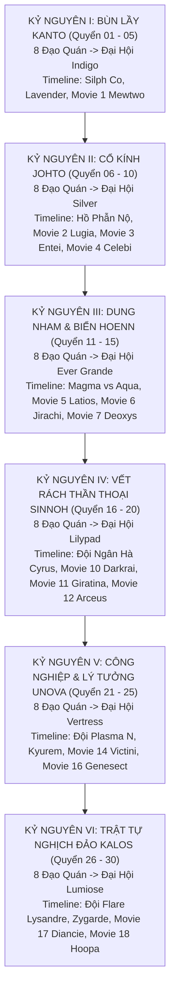

# 《Khi Pokémon Không Còn Là Trò Chơi》Thiết Lập Thánh Kinh (novel_bible.md)

## Điểm Bán Cốt Lõi
Đồng nhân Pokémon, xuyên không, phiêu lưu sinh tồn thực tế (Low-Fantasy Realism), trí tuệ thực chiến, tình bạn đồng hành (Bond), bảo lưu trọn vẹn tinh thần Anime và sự kỳ diệu cốt lõi, trưởng thành trường thiên.

Nhân vật chính Lục Trần là một người cực kỳ yêu thích Pokémon ở thế giới hiện đại. Anh am hiểu sâu rộng về anime, game, tập tính sinh thái, chiêu thức, hệ, Ability, chiến thuật Gym, Elite Four, Champion cũng như các biến cố lịch sử thế giới Pokémon. Sau một biến cố, anh xuyên không đến thế giới Pokémon và đối diện với hiện thực tự nhiên: đây là một thế giới sinh thái sống động, có quy luật sinh tồn, chuỗi thức ăn và cạm bẫy hoang dã, không phải trò chơi điện tử vô hại hay thước phim hoạt họa đơn giản hóa.

Tuy nhiên, **đây là thế giới hiện thực chứ không phải thế giới bị "hắc hóa" (grimdark)**:
- Pokémon hoang dã có tập tính săn mồi tự nhiên và phòng thủ lãnh thổ, nhưng chúng cũng là những sinh linh giàu cảm xúc, có linh tính, biết thấu hiểu và gắn kết kỳ diệu với con người.
- Xã hội loài người tồn tại mặt tối (các tổ chức tội phạm như Đội Hỏa Tiễn, Đội Magma/Aqua, Đội Ngân Hà; thị trường săn trộm chợ đen; đấu trường phi pháp), nhưng **Liên Minh và nền văn minh vẫn duy trì được trật tự, công lý và sự ấm áp**: Y tá Joy tận tụy, Sĩ quan Jenny mẫn cán, các Gym Leader mang tinh thần trách nhiệm và lòng tự tôn của người gác cổng chân chính, người dân bình dị lương thiện.
- Lục Trần không có hệ thống, không bàn tay vàng. Anh xuất thân bình dân trắng tay, vũ khí lớn nhất là tình yêu và sự hiểu biết sâu sắc về Pokémon, kết hợp với tư duy sinh tồn thực tế, khả năng thích nghi và sự trân trọng tuyệt đối dành cho sinh mệnh. Gian khổ sinh tồn là đòn bẩy để làm nổi bật lên hơi ấm của tình bạn, sự tin cậy và tinh thần phiêu lưu kỳ diệu.

---

## Triết Lý Thu Phục & Xây Dựng Đội Hình: "TÙY DUYÊN – BÌNH DÂN – ĐỘC LẠ – CHIẾN THUẬT"

1. **Không gò ép danh sách cứng – Thu phục tùy cơ duyên:**
   * Không lập sẵn danh sách cố định áp đặt từ trước; việc thu phục hoàn toàn thuận theo dòng chảy sinh tồn, nghịch cảnh ngặt nghèo và sự kiện tự nhiên.
   * Lục Trần xuất thân bình dân, không có gia thế hay tiền tài để lựa chọn giống tốt từ các trại giống quý tộc. Gặp gỡ ai, cứu sống ai, có duyên với ai thì dốc lòng bồi dưỡng và chiến đấu cùng người đó.
2. **Ưu tiên hàng đầu: Nhóm "Độc – Lạ – Dị":**
   * Ưu tiên đặc biệt cho những loài Pokémon lạ, ít gặp, ít được Trainer lựa chọn hoặc thường bị đánh giá thấp — côn trùng, ký sinh, độc tố, giáp xác, u linh, Pokémon có ngoại hình kỳ quái, tập tính đặc biệt hoặc cơ chế Ability/chiêu thức khó khai thác.
   * Lục Trần không đánh giá Pokémon dựa trên danh tiếng hay độ phổ biến. Anh sẽ quan sát đặc điểm sinh học, tập tính, thiên phú, Ability, hệ, chiêu thức và khả năng phối hợp để tìm ra hướng phát triển phù hợp cho từng cá thể.
   * Những đặc điểm mà Trainer thông thường xem là yếu điểm có thể trở thành lợi thế trong tay Lục Trần, nhưng chỉ khi chúng thực sự phù hợp với cá thể đó. Anh không ép Pokémon phát triển theo một khuôn mẫu cố định mà tìm cách biến đặc điểm riêng của từng Pokémon thành chiến thuật thực chiến.
   * Không cố tình thu thập toàn bộ Pokémon hiếm hoặc dị biệt. Việc gặp gỡ, thu phục và giữ lại một Pokémon phải có nguyên nhân hợp lý, đến từ hoàn cảnh, tính cách, sự gắn bó hoặc giá trị chiến thuật của chính cá thể đó.
3. **Đối với Pokémon Quý Hiếm / Quốc Dân:**
   * Không cấm đoán, nhưng không chạy theo phong trào. Nếu có duyên sở hữu, cá thể đó phải đến từ nghịch cảnh hoạn nạn (mẫu vật thí nghiệm bị đào thải, cá thể tàn tật bị bầy đàn xua đuổi, nạn nhân được cứu sống trong gang tấc). Sự gắn kết được tôi luyện qua máu và sinh tử.
4. **Đối với Thần Thú / Pokémon Ảo Ảnh:**
   * Mở cánh cửa cơ duyên: Nếu dòng sự kiện Movie/Anime cho phép và logic tình cảm/thực tế đạt đến độ chín, Lục Trần hoàn toàn có thể ký kết khế ước đồng hành bình đẳng hoặc thu phục Thần Thú. Tuyệt đối không "bắt thần thú giá rẻ" hay thần thánh hóa vô căn cứ.
5. **Mỗi Vùng Đất Xây Dựng Đủ Đội Hình Thi Đấu:**
   * Trên hành trình phiêu lưu qua từng vùng đất, việc thám hiểm và đối mặt với thử thách sinh tồn sẽ tự nhiên giúp Lục Trần kết nạp ~6 Pokémon bản địa để tham gia trọn vẹn 8 Đạo Quán và Đại Hội Liên Minh của vùng đó.
   * Cựu binh không bị bỏ rơi mà được luân chuyển chiến thuật trong các đại án giải cứu thế giới.

---

## Pokémon Khởi Đầu (Quyển 1 - Rừng Viridian): PARAS (Nấm Ký Sinh Dị Biến)

* **Loài:** Paras (Ấu trùng Bọ Côn trùng / Cỏ) $\rightarrow$ Sau này tiến hóa thành **Parasect (Bào Tử Zombie Thao Túng Thần Kinh)**.
* **Nguồn gốc:** Sinh sống dưới lớp đất mùn ẩm thấp của Rừng Viridian; nhiễm phải chất thải độc hại từ trạm săn trộm dã chiến khiến cây nấm Tochukaso trên lưng phát triển đột biến quá sớm, hút cạn sinh lực ấu trùng và bị đồng loại xua đuổi.
* **Cơ duyên:** Trong đêm bão nhiệt đới sạt lở bờ đất (Chương 4), Paras non thoi thóp trong hốc rễ cây mục được Lục Trần đánh cược tính mạng cứu sống. Anh dùng kiến thức thảo dược học dã ngoại kìm hãm độc tính của nấm, tái lập trạng thái cân bằng sinh học cộng sinh (Symbiosis).
* **Đặc tính chiến đấu:**
  * Không hào nhoáng như rồng lửa; lẩn khuất dưới bóng râm và thảm lá mục.
  * Cặp vuốt kẹp rèn giũa sắc nhọn, định vị chấn động mặt đất.
  * Bào tử thôi miên (*Sleep Powder*), phấn gây tê (*Stun Spore*), bào tử ngủ tuyệt đối (*Spore*).
  * Kỹ năng sinh tồn cự ly gần: Rút cạn sinh lực (*Absorb / Mega Drain / Leech Life*).

---

## Quy Mô Toàn Thư & Khung Trục 6 Đại Kỷ Nguyên (6 Vùng Đất)

* **Quy mô:** 700 vạn chữ ｜ 30 Quyển ｜ 6 Đại Kỷ Nguyên.
* **Số từ mỗi chương:** 3000 – 3600 từ.
* **Mục tiêu xuyên suốt:** Tham dự đầy đủ **tất cả 8 Đạo Quán + Đại Hội Liên Minh** của toàn bộ 6 vùng đất; quét sạch và can thiệp sâu sắc vào **Timeline Anime chính tuyến & Đại án Movie kinh điển**.

### Chi Tiết Phân Bổ 6 Đại Kỷ Nguyên:

1. **Kỷ Nguyên I: Bùn Lầy Kanto (Quyển 01 – Quyển 05)**
   * *Địa bàn:* Viridian, Pewter, Cerulean, Vermilion, Celadon, Fuchsia, Saffron, Cinnabar, Indigo Plateau.
   * *Giải đấu:* 8 Huy chương Kanto $\rightarrow$ Đại hội Liên Minh Indigo Plateau.
   * *Timeline Anime & Movie:* Oán linh Marowak Tháp Lavender; Chiến dịch giải cứu Silph Co; Đạo quán Viridian và Thống lĩnh Giovanni; **Movie 1 (Mewtwo Strikes Back & Dinh thự Cinnabar)**.
2. **Kỷ Nguyên II: Cổ Kính Johto (Quyển 06 – Quyển 10)**
   * *Địa bàn:* New Bark, Violet, Azalea, Goldenrod, Ecruteak, Olivine, Cianwood, Mahogany, Blackthorn.
   * *Giải đấu:* 8 Huy chương Johto $\rightarrow$ Đại hội Liên Minh Silver Conference.
   * *Timeline Anime & Movie:* Xung đột công nghệ - truyền thống tại Tháp Chuông; Tàn dư Đội Hỏa Tiễn và Gyarados Đỏ đột biến sóng vô tuyến tại Hồ Phẫn Nộ; Long Quật Blackthorn; **Movie 2 (Lugia Shamouti)**, **Movie 3 (Thần Chú Unown & Entei)**, **Movie 4 (Celebi & Thợ săn sắt)**.
3. **Kỷ Nguyên III: Dung Nham & Biển Hoenn (Quyển 11 – Quyển 15)**
   * *Địa bàn:* Littleroot, Rustboro, Dewford, Slateport, Mauville, Lavaridge, Petalburg, Fortree, Mossdeep, Sootopolis.
   * *Giải đấu:* 8 Huy chương Hoenn $\rightarrow$ Đại hội Liên Minh Ever Grande Conference.
   * *Timeline Anime & Movie:* Cuộc chiến tranh môi trường cực đoan Đội Magma vs Đội Aqua; Thức tỉnh Địa Thần Groudon và Hải Thần Kyogre; Hợp tác tác chiến với Steven Stone; **Movie 5 (Latios/Latias Altomare)**, **Movie 6 (Jirachi Ngôi Sao Ước Nguyện)**, **Movie 7 (Deoxys vs Rayquaza)**.
4. **Kỷ Nguyên IV: Vết Rách Thần Thoại Sinnoh (Quyển 16 – Quyển 20)**
   * *Địa bàn:* Twinleaf, Oreburgh, Eterna, Veilstone, Pastoria, Hearthome, Canalave, Snowpoint, Sunyshore.
   * *Giải đấu:* 8 Huy chương Sinnoh $\rightarrow$ Đại hội Liên Minh Lilypad League (đối đầu Tobias / các quái kiệt ẩn danh).
   * *Timeline Anime & Movie:* Triết học hư vô của Cyrus (Đội Ngân Hà); Âm mưu xóa sổ vũ trụ trên Đỉnh Spear Pillar; Thế Giới Đảo Ngược (Distortion World) đối đầu Giratina; Liên minh sinh tồn cùng Cynthia; **Movie 10 (Darkrai Alamos)**, **Movie 11 (Shaymin & Giratina)**, **Movie 12 (Arceus)**.
5. **Kỷ Nguyên V: Công Nghiệp & Lý Tưởng Unova (Quyển 21 – Quyển 25)**
   * *Địa bàn:* Nuvema, Striaton, Nacrene, Castelia, Nimbasa, Driftveil, Mistralton, Icirrus, Opelucid.
   * *Giải đấu:* 8 Huy chương Unova $\rightarrow$ Đại hội Liên Minh Vertress Conference.
   * *Timeline Anime & Movie:* Phong trào tôn giáo giải phóng Pokémon của N; Bóc trần sự thao túng chính trị của Ghetsis (Đội Plasma); Thảm họa phong ấn rồng băng Kyurem; **Movie 14 (Victini & Reshiram/Zekrom)**, **Movie 15 (Keldeo)**, **Movie 16 (Genesect thức tỉnh tại New Tork City)**.
6. **Kỷ Nguyên VI: Trật Tự Nghịch Đảo Kalos (Quyển 26 – Quyển 30)**
   * *Địa bàn:* Vaniville, Santalune, Cyllage, Shalour, Coumarine, Lumiose, Laverre, Anistar, Snowbelle.
   * *Giải đấu:* 8 Huy chương Kalos $\rightarrow$ Đại hội Liên Minh Lumiose Conference.
   * *Timeline Anime & Movie:* Kế hoạch thanh trừng thế giới của Lysandre (Đội Flare); Kích hoạt Vũ khí Tối Thượng; Ngăn chặn sự hủy diệt của Zygarde lõi đỏ; **Movie 17 (Diancie & Yveltal Kén Hủy Diệt)**, **Movie 18 (Ma Thần Hoopa)**, **Movie 19 (Cơ Giới Thần Volcanion & Trái Tim Nhân Tạo Magearna)**.
   * *Kết cục toàn thư:* Lục Trần trở thành Người Chấp Pháp Độc Lập Tối Cao của thế giới Pokémon, thiết lập ranh giới cân bằng vĩnh cửu giữa con người và nanh vuốt tự nhiên.

---

## Thiết Lập Cơ Bản

* **Độc giả mục tiêu:** Độc giả yêu thích Pokémon muốn tìm kiếm góc nhìn trưởng thành, sinh tồn thực chiến, chiều sâu sinh thái học và xã hội học nhưng vẫn giữ trọn linh hồn ấm áp, phiêu lưu và kỳ diệu của Pokémon nguyên bản; cấm lối viết trẻ con, cấm bàn tay vàng lố bịch và cấm hắc hóa bừa bãi.
* **Thời đại / Thế giới quan:** Thế giới Pokémon đương đại song song anime, cơ chế vật lý, sinh thái sinh học và quy luật xã hội được mô tả thực tế (thương tật, chuỗi thức ăn, chi phí nuôi dưỡng, luật pháp Liên Minh, các tổ chức ngầm tội phạm).
* **Hệ thống sức mạnh:** Tuyệt đối không dùng hệ thống, cảnh giới tiên hiệp, linh lực hay số liệu chỉ số game. Sức mạnh đến từ cấu tạo giải phẫu học, thể chất, độ thuần thục chiêu thức, phản xạ thần kinh, cạm bẫy địa hình và sự am hiểu chiến thuật.
* **Nhân vật chính:** Lục Trần — Người hiện đại xuyên không, yêu mến Pokémon, bình tĩnh, thực tế, quyết đoán trong tự vệ và sinh tồn dã ngoại; sở hữu kho tàng tri thức sinh thái phong phú; trân trọng sinh mệnh và kiên định giữ vững nhân tính cùng sự gắn kết ấm áp với Pokémon đồng hành.
* **Điều cấm kỵ (Taboos):**
  * CẤM đặt tên riêng hoặc biệt danh (nickname) cho Pokémon: Tuyệt đối không đặt biệt danh kiểu nhân hóa (như Bào Tử, Tiểu Hỏa Long...). Pokémon luôn được gọi bằng tên chủng loài chính thức (Paras, Zubat, Pikachu...) hoặc từ ngữ miêu tả sinh học tự nhiên (chú bọ nhỏ, con dơi non...), bảo lưu đúng phong cách và sự tôn trọng của Anime/Game nguyên bản.
  * CẤM hắc hóa cực đoan (Grimdark / Edgelord): Tuyệt đối không biến Lục Trần thành sát thủ máu lạnh, kẻ giết người vô cảm hay tống tiền đê tiện; không biến toàn bộ xã hội thành địa ngục tha hóa hay bôi đen nhân cách của các nhân vật chính diện kinh điển (Joy, Jenny, Brock, Misty, Ash, Red... phải giữ được phẩm chất cao đẹp, lòng trắc ẩn và cá tính riêng của họ).
  * CẤM tu tiên hóa Pokémon (huyết mạch thức tỉnh, đan dược, độ kiếp).
  * CẤM cơ giới hóa giải cứu (Deus Ex Machina) — nhân vật chính tự dựa vào trí tuệ, kiến thức sinh thái và sự gắn kết với đồng đội để vượt qua thử thách.
  * CẤM tình tiết hậu cung vô nghĩa, cấm bôi chữ thủ tục hành chính.
