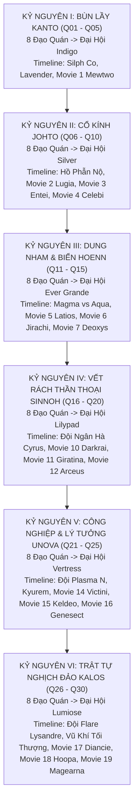

# PHẦN 2: BẢN DÀN Ý TỐI ƯU HOÀN THIỆN NHẤT

---

## KHUNG TRỤC ĐẠI CƯƠNG PHÂN QUYỂN TOÀN THƯ (SERIES STORY ARCS)
**Quy mô:** 700 vạn chữ ｜ 30 Quyển ｜ 6 Đại Kỷ Nguyên (Cân bằng tuyệt đối: 5 Quyển / Vùng Đất)  
**Mục tiêu bắt buộc:** Tham dự trọn vẹn **8 Đạo Quán + Đại Hội Liên Minh** của cả 6 vùng đất; quét sạch và can thiệp sâu sắc vào **Timeline Anime chính tuyến & Đại án Movie kinh điển**.  
**Đội hình:** Tùy duyên sinh tồn, xuất thân bình dân, ưu tiên nhóm Độc – Lạ – Dị – Chiến thuật sinh học tàn nhẫn; mở cửa khế ước Thần Thú khi đạt độ chín muồi logic.

---

### CHI TIẾT 6 ĐẠI KỶ NGUYÊN TOÀN THƯ (30 QUYỂN)

#### KỶ NGUYÊN I: BÙN LẦY KANTO & KHỞI NGUYÊN TRO TÀN (Quyển 01 – Quyển 05)
*   **Quyển 01 (Chương 001 – 030): Rừng Thẳm Sinh Tồn & Bào Tử Khởi Nguyên**
    *Chủ đề:* Sự tỉnh ngộ trần trụi trước tự nhiên máu thịt; cứu sống Paras (nấm dị biến EXP-046) và Zubat (cánh rách); đập tan trạm săn trộm dã chiến; dùng bằng chứng tống tiền đoạt Thẻ Huấn Luyện Viên Tự Do tại trạm biên phòng Viridian.
*   **Quyển 02 (Chương 031 – 090): Thiết Luật Pewter & Dị Biến Mt. Moon**
    *Chủ đề:* Đô thị thợ mỏ Pewter ngột ngạt; Đạo quán Boulder của Brock là pháo đài phòng thủ quân sự; Lục Trần thâm nhập hầm mỏ bỏ hoang, săn bắt sinh vật lòng đất đột biến; ngăn chặn đường dây buôn lậu Moon Stone của Đội Hỏa Tiễn tại Mt. Moon; đoạt Huy chương Boulder.
*   **Quyển 03 (Chương 091 – 150): Sóng Ngầm Cerulean & Bão Lửa Vermilion**
    *Chủ đề:* Mặt tối sau vẻ thơ mộng của Cerulean (Misty); cuộc gặp gỡ bí mật với dị nhân Bill tại ngọn hải đăng; thảm họa Gyarados nhiễm chất độc hóa chất xả thải; Vermilion - căn cứ hải quân ngưng trệ sau chiến tranh; Trung tá Lt. Surge và hội cựu binh mang hội chứng PTSD; đoạt Huy chương Cascade và Huy chương Thunder.
*   **Quyển 04 (Chương 151 – 210): Tử Khí Lavender & Trái Tim Celadon**
    *Chủ đề:* Tháp Lavender không có hào quang cứu rỗi mà chỉ có tử khí, kền kền và kẻ trộm mộ; bi kịch mẹ con Marowak; Celadon - thủ phủ cờ bạc và sào huyệt ngầm Đội Hỏa Tiễn; liên thủ với Erika và thám tử Interpol Lookup; chiến dịch giải cứu Tập đoàn Silph Co; đoạt Huy chương Rainbow.
*   **Quyển 05 (Chương 211 – 280): Hỏa Ngục Cinnabar, Độc Đạo Fuchsia & Đỉnh Cao Indigo**
    *Chủ đề:* Khu bảo tồn Safari Fuchsia (Koga) và nghệ thuật ám sát Ninja; Đạo quán Saffron (Sabrina); Đảo núi lửa Cinnabar (Blaine) và thâm nhập tàn tích dự án Mewtwo (**Movie 1 Can thiệp**); đại chiến Đạo Quán Viridian đối đầu trực diện Thống lĩnh Giovanni; Đại hội Liên Minh Indigo Plateau đẫm máu; Lục Trần từ chối làm con rối chính trị, dấn thân sang Johto.

#### KỶ NGUYÊN II: CỔ KÍNH JOHTO & KHÚC CHIÊU HỒN CỔ ĐẠI (Quyển 06 – Quyển 10)
*   **Quyển 06 (Chương 281 – 340): Mầm Sống Rừng Sồi & Tiếng Chuông Violet**
    *Chủ đề:* Cố đô Johto cổ kính; Đạo quán Violet (Falkner) và Đạo quán Azalea (Bugsy); Rừng Ilex và Thần Rừng Celebi (**Movie 4: Celebi & Thợ Săn Mặt Nạ Sắt**); Lục Trần ngăn chặn thợ săn công nghệ cao tàn phá sinh thái thời gian; học nghệ thuật Apricorn Ball từ nghệ nhân Kurt; đoạt Huy chương Zephyr và Hive.
*   **Quyển 07 (Chương 341 – 400): Tháp Tro Ecruteak & Ba Ngọn Lửa Thiêng**
    *Chủ đề:* Đạo quán Goldenrod (Whitney) - cỗ xe bọc thép Miltank; Tháp Cháy Ecruteak (Morty); bi kịch cổ xưa và sự thức tỉnh cuồng nộ của Ba Thánh Thú (Raikou, Entei, Suicune); hóa giải ảo ảnh Unown tâm linh (**Movie 3: Entei & Thần Chú Unown**); đoạt Huy chương Plain và Fog.
*   **Quyển 08 (Chương 401 – 460): Hải Đăng Bão Tố & Sóng Thần Shamouti**
    *Chủ đề:* Đạo quán Olivine (Jasmine - Steelix thiết giáp) và Đạo quán Cianwood (Chuck); thảm họa dị biến khí hậu biển sâu tại quần đảo Shamouti khi nhà sưu tập săn lùng Ba Chim Thần (**Movie 2: Lugia Shamouti**); Lục Trần cùng Hải Thần Lugia bảo vệ hải lưu sinh mệnh; đoạt Huy chương Mineral và Storm.
*   **Quyển 09 (Chương 461 – 520): Huyết Nhuộm Hồ Phẫn Nộ & Long Quật Blackthorn**
    *Chủ đề:* Tàn dư Đội Hỏa Tiễn phát sóng vô tuyến ép tiến hóa tại Hồ Phẫn Nộ; giải cứu Gyarados Đỏ; liên thủ cùng Lance càn quét căn cứ ngầm Mahogany; tiến vào Long Quật Blackthorn (Clair); vượt qua khảo nghiệm Long huyết cổ đại; đoạt Huy chương Glacier và Rising.
*   **Quyển 10 (Chương 521 – 580): Ngân Sơn Bão Tuyết & Đại Hội Bạc Đỉnh Cao**
    *Chủ đề:* Sinh tồn cấm địa tử thần Mt. Silver; đối thoại chiến thuật đỉnh cao trên đỉnh bão tuyết cùng Red; bước vào Đại Hội Bạc (Silver Conference) đập tan các đường dây cá cược ngầm; đoạt danh hiệu Quán quân Johto; tiếp nhận thông tin về biến động dị thường của lục địa và biển sâu tại Hoenn.

#### KỶ NGUYÊN III: DUNG NHAM & ĐẠI DƯƠNG HOENN (Quyển 11 – Quyển 15)
*   **Quyển 11 (Chương 581 – 640): Rừng Mưa Petalburg & Đá Ngầm Rustboro**
    *Chủ đề:* Đạo quán Rustboro (Roxanne) và Dewford (Brawly); gặp gỡ Steven Stone tại hang granite sâu thẳm; Đạo quán Petalburg (Norman); khám phá thành phố nước ngầm Altomare (**Movie 5: Vệ Thần Latios & Latias**); đoạt 3 huy chương đầu tiên.
*   **Quyển 12 (Chương 641 – 700): Bão Cát Mauville & Hỏa Ngục Mt. Chimney**
    *Chủ đề:* Đạo quán Mauville (Wattson) và Lavaridge (Flannery); cuộc chiến tranh đoạt Thiên Thạch tại Mt. Chimney giữa Đội Magma và Đội Aqua; ngăn chặn kích nổ núi lửa; thức tỉnh Ngôi sao Ước nguyện Jirachi (**Movie 6: Jirachi**); đoạt Huy chương Dynamo và Heat.
*   **Quyển 13 (Chương 701 – 760): Vòm Rừng Fortree & Tháp Gió Mossdeep**
    *Chủ đề:* Đạo quán Fortree (Winona - không chiến bão táp); Đạo quán Mossdeep (Tate & Liza - song đấu tâm linh); đền thờ Mt. Pyre bị cướp bóc Ngọc Đỏ và Ngọc Xanh; bóc trần căn cứ tàu ngầm của Đội Thủy Tề; đoạt Huy chương Feather và Mind.
*   **Quyển 14 (Chương 761 – 820): Khải Huyền Thần Thoại: Địa Chấn & Đại Hồng Thủy**
    *Chủ đề:* Groudon và Kyogre Cổ Đại thức tỉnh; hạn hán khô cháy và sóng thần hủy diệt đan xen toàn cầu; Lục Trần cùng Steven Stone tử thủ Sootopolis; dấn thân lên Cột Trụ Trời (Sky Pillar) triệu hoán Rồng Thần Rayquaza; can thiệp đại chiến Deoxys vs Rayquaza (**Movie 7: Deoxys**); đoạt Huy chương Rain.
*   **Quyển 15 (Chương 821 – 880): Đỉnh Cao Ever Grande & Lời Mời Khảo Cổ Sinnoh**
    *Chủ đề:* Đấu trường Ever Grande quy tụ các bậc thầy thời tiết; Lục Trần phô diễn chiến thuật dị biệt khắc chế hoàn toàn các trường phái chính thống; đọ sức kinh điển cùng Steven Stone; tiếp nhận lời mời của Nữ Quán quân Cynthia bước sang vùng đất Sinnoh.

#### KỶ NGUYÊN IV: VẾT RÁCH THẦN THOẠI SINNOH (Quyển 16 – Quyển 20)
*   **Quyển 16 (Chương 881 – 940): Than Đá Oreburgh & Rừng Già Eterna**
    *Chủ đề:* Đạo quán Oreburgh (Roark) và Eterna (Gardenia); dấu vết đầu tiên của Đội Ngân Hà (Galactic); đại chiến Thời Không làm sụp đổ thành phố Alamos và khúc tráng ca bi tráng của Darkrai (**Movie 10: Darkrai**); đoạt Huy chương Coal và Forest.
*   **Quyển 17 (Chương 941 – 1000): Thiết Bích Veilstone & Đầm Lầy Pastoria**
    *Chủ đề:* Đạo quán Veilstone (Maylene), Pastoria (Crasher Wake) và Hearthome (Fantina); bóc trần các trại tập trung thí nghiệm cưỡng chế tinh thần của Mars và Jupiter; đoạt Huy chương Cobble, Fen và Relic.
*   **Quyển 18 (Chương 1001 – 1060): Thư Viện Canalave & Lời Nguyền Ba Hồ Thánh**
    *Chủ đề:* Đạo quán Canalave (Byron); Đội Ngân Hà đánh bom Hồ Valor, bắt cóc Ba Thần Hồ (Uxie, Mesprit, Azelf) rèn Xích Đỏ; rèn luyện tại Đảo Sắt cùng Riley; hoàn tất Huy chương Mine, Icicle (Candice) và Beacon (Volkner).
*   **Quyển 19 (Chương 1061 – 1120): Đỉnh Spear Pillar & Thế Giới Nghịch Chuyển**
    *Chủ đề:* Cyrus dùng Xích Đỏ trói buộc Dialga và Palkia trên đỉnh Spear Pillar; Giratina kéo Cyrus xuống đáy vực; Lục Trần cùng Cynthia dấn thân vào Thế Giới Đảo Ngược (**Movie 11: Giratina & Sứ Giả Bầu Trời Shaymin**); trận tử chiến tư tưởng đỉnh cao với Cyrus.
*   **Quyển 20 (Chương 1121 – 1180): Ánh Sáng Sáng Thế Arceus & Đại Hội Lilypad**
    *Chủ đề:* Sự thức tỉnh phẫn nộ của Đấng Sáng Thế Arceus và âm mưu cướp đoạt Bánh Tảo Mệnh Quang (**Movie 12: Arceus**); Lục Trần dùng sự đồng cảm sinh mệnh hóa giải hiểu lầm ngàn năm; bước vào Đại Hội Lilypad League, đập tan "Trainer Thần Thú" Tobias bằng chiến thuật phân rã cực hạn.

#### KỶ NGUYÊN V: CÔNG NGHIỆP & LÝ TƯỞNG UNOVA (Quyển 21 – Quyển 25)
*   **Quyển 21 (Chương 1181 – 1240): Rừng Bê Tông Castelia & Tiếng Kèn Giải Phóng**
    *Chủ đề:* Đạo quán Striaton, Nacrene (Lenora) và Castelia (Burgh); làn sóng truyền đạo cực đoan của Đội Plasma: "Con người đang nô dịch hóa Pokémon"; cuộc chạm trán triết học đầu tiên với Vương tử N; đoạt 3 huy chương đầu tiên.
*   **Quyển 22 (Chương 1241 – 1300): Ánh Đèn Nimbasa & Mỏ Khoáng Driftveil**
    *Chủ đề:* Đạo quán Nimbasa (Elesa), Driftveil (Clay) và Mistralton (Skyla); phong trào dân túy bạo động do Thất Hiền Nhân giật dây; can thiệp năng lượng rồng cổ đại tại Lâu đài Éind (**Movie 14: Victini & Zekrom/Reshiram**); đoạt Huy chương Bolt, Quake và Jet.
*   **Quyển 23 (Chương 1301 – 1360): Băng Động Icirrus & Thiết Thành Opelucid**
    *Chủ đề:* Đạo quán Icirrus (Brycen) và Opelucid (Drayden/Iris); Thánh Kiếm Sĩ Keldeo và Rồng Băng Kyurem (**Movie 15: Keldeo**); Lục Trần giúp Keldeo lĩnh ngộ kiếm ý sinh tồn chân chính; đoạt trọn vẹn 8 Huy chương Unova.
*   **Quyển 24 (Chương 1361 – 1420): Lâu Đài Tách Rời & Bản Án Của N**
    *Chủ đề:* Cung Điện N trồi lên từ lòng đất tại Đại hội Vertress; N cưỡi Zekrom đánh bại Quán quân Alder; Lục Trần bước lên cung điện bay, dùng trận quyết đấu bằng đội hình bình dân chứng minh: Sự gắn kết giữa người và Pokémon là cùng nhau tiến hóa chứ không phải nô dịch; N thức tỉnh.
*   **Quyển 25 (Chương 1421 – 1480): Băng Giá Hủy Diệt & Cổ Sinh Hóa Genesect**
    *Chủ đề:* Ghetsis mượn danh lý tưởng lộ dã tâm độc tài, dùng Kyurem đóng băng Unova; Lục Trần phản kích phá hủy tàu chiến Plasma Frigate; giải cứu bầy dã thú cơ giới hóa Genesect thức tỉnh tại New Tork City (**Movie 16: Genesect**); tiến sang Kalos.

#### KỶ NGUYÊN VI: TRẬT TỰ NGHỊCH ĐẢO KALOS & TÂN THẾ GIỚI (Quyển 26 – Quyển 30)
*   **Quyển 26 (Chương 1481 – 1540): Ánh Sáng Shalour & Cội Nguồn Siêu Tiến Hóa**
    *Chủ đề:* Đạo quán Santalune, Cyllage và Shalour (Korrina); giải mã bản chất sinh học của Mega Evolution: sự cộng hưởng tần số tế bào và nhịp tim cực hạn; Công chúa Kim Cương Diancie và Kén Hủy Diệt Yveltal thức tỉnh (**Movie 17: Diancie**); đoạt 3 huy chương đầu tiên.
*   **Quyển 27 (Chương 1541 – 1600): Đầm Lầy Coumarine & Tháp Điện Lumiose**
    *Chủ đề:* Đạo quán Coumarine (Ramos), Lumiose (Clemont) và Laverre (Valerie); sự xâm nhập ngầm của Lysandre Labs; mạng lưới tình báo Đội Hỏa Diệm (Flare); đoạt Huy chương Plant, Voltage và Fairy.
*   **Quyển 28 (Chương 1601 – 1660): Nhật Cổ Anistar & Bão Tuyết Snowbelle**
    *Chủ đề:* Đạo quán Anistar (Olympia) và Snowbelle (Wulfric); hoàn tất 8 huy chương Kalos; can thiệp ma thần Hoopa triệu hoán Thần Thú đại chiến tại Desert City (**Movie 18: Hoopa**); giải cứu Vương quốc cơ giới Azoth và Trái Tim Magearna (**Movie 19: Magearna & Volcanion**).
*   **Quyển 29 (Chương 1661 – 1720): Cỗ Máy Hủy Diệt 3000 Năm & Đại Chiến Lumiose**
    *Chủ đề:* Đại hội Lumiose bùng nổ; Lysandre kích hoạt Vũ Khí Tối Thượng 3000 năm nhằm thanh lọc thế giới; Lục Trần cùng các Quán quân tử chiến đỉnh Tháp Prism; thức tỉnh Vệ Thần Trật Tự Zygarde 100% hình thái hoàn chỉnh đập tan cỗ máy diệt vong.
*   **Quyển 30 (Chương 1721 – 1800): Bản Tuyên Ngôn Tân Thế Giới (Đại Kết Cục)**
    *Chủ đề:* Bóc trần sự tha hóa của Hội đồng Trưởng lão Liên Minh; Lục Trần từ chối ngai vàng chính trị, trở thành "Người Chấp Pháp Tối Cao Độc Lập" (Grand Warden of Natural Balance); thiết lập ranh giới bảo hộ sinh thái hoang dã bất khả xâm phạm và quy chuẩn nhân đạo mới; Lục Trần cùng các đồng đội sinh tử quay về với thiên nhiên hoang dã vĩ đại.

---

## BẢN DÀN Ý CHI TIẾT TỪNG CHƯƠNG: QUYỂN 1 (CHƯƠNG 01 – 30)

### TỔNG QUAN QUYỂN 1
*   **Tên Quyển:** MÁU NHUỘM RỪNG HOANG, BÀO TỬ KHỞI NGUYÊN
*   **Khoảng chương:** Chương 001 – Chương 030 (Quyển mở màn hoàn chỉnh)
*   **Mục tiêu giai đoạn:** Lục Trần lột xác từ một kẻ hiện đại mang tư duy màu hồng thành một Thợ Săn Sinh Tồn dạn dày sương gió; cứu sống và thiết lập khế ước cộng sinh máu thịt với Paras (ấu thú mang nấm dị biến EXP-046) cùng Zubat (cánh rách); đập tan phân trạm săn trộm dã chiến; dùng đòn bẩy chứng cứ tống tiền ép viên trạm trưởng tham nhũng cấp Thẻ Huấn Luyện Viên Tự Do hợp pháp.
*   **Móc câu chuyển giao quyển:** Đứng trước cửa ải Đạo Quán Viridian khép kín dưới màn đêm, Lục Trần nhận diện cái bóng khổng lồ của Thống lĩnh Giovanni đang bao trùm toàn bộ Kanto.

---

### CHI TIẾT CÁC CHƯƠNG (CHAPTER BEATS)

* **Chương 1: Tỉnh Giấc Dưới Móng Vuốt**
  * *Sự kiện cốt lõi:* Lục Trần tỉnh dậy giữa bóng tối ẩm mốc của Rừng Viridian, tận mắt chứng kiến một con Pidgeotto hoang dã dùng móng thép xé toạc bụng Rattata và nuốt chửng từng mảng thịt tươi đẫm máu.
  * *Tiến triển cốt truyện & Sảng điểm:* Đập tan hoàn toàn ảo tưởng êm đềm từ anime và game; bản năng sinh tồn thời tiền sử lập tức được kích hoạt khi Lục Trần nhận ra ở thế giới này con người chỉ là một mắt xích yếu ớt trong chuỗi thức ăn hoang dã.
  * *Móc câu cuối chương:* Mùi máu tanh từ xác con mồi vừa bốc lên, bụi cây rậm rạp phía sau Lục Trần bỗng rung chuyển dữ dội bởi tiếng thở phì phò nặng nề của một dã thú khát máu.

* **Chương 2: Lãnh Thổ Răng Nhọn**
  * *Sự kiện cốt lõi:* Lục Trần lăn xả vào bụi gai độc để thoát khỏi cú vồ chí mạng của một con Arbok đói ăn, dùng bùn hôi che giấu thân nhiệt và mùi cơ thể trước khi trườn qua khe suối cạn.
  * *Tiến triển cốt truyện & Sảng điểm:* Vận dụng tri thức sinh học thực tế để đọc dấu vết lãnh thổ, phân biệt bãi phân và vết cào vỏ cây của thú ăn thịt; kiểm soát nỗi sợ tột cùng bằng tư duy phân tích lạnh lùng.
  * *Móc câu cuối chương:* Tiếng đập cánh vo ve nghẹt thở của đàn Beedrill tuần tra rền vang ngay trên đỉnh ngọn cây, trong khi phía trước là vách đá dựng đứng không lối thoát.

* **Chương 3: Hốc Đá Răng Cưa**
  * *Sự kiện cốt lõi:* Bị dồn vào chân vách núi, Lục Trần phát hiện một hang đá cạn nhưng nơi này đã bị chiếm giữ bởi một con Mankey cuồng bạo đang gãy một bên chân.
  * *Tiến triển cốt truyện & Sảng điểm:* Không lao vào đánh nhau phi lý; Lục Trần dùng quả dại có vị chát cực mạnh dụ Mankey nổi điên đập vỡ tảng đá chặn cửa, sau đó lách qua khe hẹp chốt chặt hang ổ bằng thân cây khô.
  * *Móc câu cuối chương:* Khi cánh cửa hang vừa đóng lại, bầu trời rách toạc bởi tia sét chói lòa, báo hiệu một cơn bão nhiệt đới kinh hoàng sắp càn quét toàn bộ khu rừng.

* **Chương 4: Đốm Nấm Bùn Lầy**
  * *Sự kiện cốt lõi:* Mưa bão quất tơi bời làm sạt lở bờ đất trước cửa hang, để lộ một ấu thú Paras bị vùi lấp trong bùn rễ mục; trên lưng nó là hai cụm nấm Tochukaso đột biến đỏ rực đang phát triển dị thường, hút cạn sinh lực ấu trùng; dưới bụng có vết sẹo phẫu thuật nhân tạo mang mã số "EXP-046".
  * *Tiến triển cốt truyện & Sảng điểm:* Đánh cược tính mạng lao mình vào tâm bão kéo ấu thú bọ nấm ra khỏi dòng bùn xiết; nhận diện đây là mẫu vật thí nghiệm kích thích bào tử độc của con người bị đào thải vì mất kiểm soát.
  * *Móc câu cuối chương:* Vỏ kitin của Paras bắt đầu nứt toác vì rễ nấm ăn sâu vào hạch thần kinh, cặp mắt trắng dã co giật dữ dội cận kề cái chết.

* **Chương 5: Giành Giật Hơi Tàn**
  * *Sự kiện cốt lõi:* Giữa đêm mưa lạnh giá thiếu thốn thuốc men, Lục Trần dùng tro than gỗ khô kiềm chế độ ẩm, dùng nhựa cây thảo mộc kiềm hãm sự lan rộng của rễ nấm độc, liên tục xoa bóp tuần hoàn dịch bọ cho Paras.
  * *Tiến triển cốt truyện & Sảng điểm:* Vận dụng sâu sắc tri thức côn trùng học và nấm học dã ngoại cứu sống ấu trùng; tái lập thế cân bằng sinh học cộng sinh (Symbiosis) giữa vật chủ và nấm; giật lại sinh mệnh từ tay tử thần bằng ý chí sắt đá.
  * *Móc câu cuối chương:* Cặp mắt trắng đục của Paras khẽ chớp động qua làn hơi nước, cặp càng răng cưa khẽ giật giật chạm vào ngón tay rớm máu của Lục Trần.

* **Chương 6: Lời Hứa Đêm Mưa Bão**
  * *Sự kiện cốt lõi:* Paras tỉnh lại giương cặp vuốt kẹp phòng thủ theo bản năng thú hoang từng bị hành hạ; Lục Trần lặng lẽ nhường nửa củ rễ rừng ngọt nước và dòng nước ấm duy nhất, dùng ngôn ngữ sinh thái xoa dịu nỗi đau.
  * *Tiến triển cốt truyện & Sảng điểm:* Thiết lập sợi dây liên kết tâm hồn dựa trên sự sẻ chia sinh mệnh giữa hai kẻ bị thế giới ruồng bỏ; ánh mắt của Paras từ cảnh giác hoảng loạn chuyển sang nương tựa và thuần phục.
  * *Móc câu cuối chương:* Màn mưa ngoài cửa hang vừa ngớt, một tiếng rít the thé đầy hận thù vang lên cùng tiếng móng vuốt cào sột soạt vào vách đá ngay trên nóc hang.

* **Chương 7: Dinh Dưỡng Thể Phách**
  * *Sự kiện cốt lõi:* Paras kiệt quệ thể chất; Lục Trần mạo hiểm trèo lên các thân cây mục săn bắt ấu trùng giàu protein và rễ thảo mộc giàu khoáng để nấu hỗn hợp dinh dưỡng đặc thù cho bọ ăn nấm.
  * *Tiến triển cốt truyện & Sảng điểm:* Xây dựng chế độ dinh dưỡng dã ngoại chân thực thay vì thức ăn viên tiện lợi vô lý; thể hiện tầm quan trọng của hậu cần trong việc gia cố lớp vỏ kitin và nuôi dưỡng nấm cộng sinh.
  * *Móc câu cuối chương:* Khi đang thu hái quả Oran trên gò đất cao, mùi xạ hương nồng nặc bốc lên từ bụi rậm, kèm theo hai đốm mắt vàng rực đang khóa chặt vào gáy Lục Trần.

* **Chương 8: Nanh Vuốt Đột Kích**
  * *Sự kiện cốt lõi:* Một con Raticate khổng lồ nhiễm độc cuồng bạo lao ra tấn công; Lục Trần dùng gậy đá nghênh chiến; Paras phối hợp tung ra chiêu Phấn Gây Tê (Stun Spore) đầu tiên làm tê liệt phản xạ đối thủ.
  * *Tiến triển cốt truyện & Sảng điểm:* Sự phối hợp ăn ý sơ khai giữa Người và Pokémon; bào tử phấn của Paras dù mới hồi phục nhưng phát huy hiệu quả phong tỏa thần kinh cực kỳ chuẩn xác, bù đắp chênh lệch thể hình.
  * *Móc câu cuối chương:* Raticate phát cuồng vì đau đớn, cơ bắp căng phồng dị thường, nhe cặp răng cửa sắc lẹm phủ đầy chất nhầy tím đen lao thẳng vào cổ họng Lục Trần.

* **Chương 9: Huyết Chiến Bùn Lầy**
  * *Sự kiện cốt lõi:* Trận tử chiến cự ly không; Lục Trần hy sinh cánh tay trái quấn vải thô đỡ cú cắn xé rách thịt, tạo góc chết cho Paras trườn tới cắm phập cặp vuốt kẹp sắc nhọn xé toạc yết hầu kẻ địch.
  * *Tiến triển cốt truyện & Sảng điểm:* Tinh thần quyết tử không lùi bước; chiến thắng sinh tồn đầu tiên bằng máu và nanh vuốt thực thụ; tôi luyện sự tàn nhẫn và bình tĩnh cần thiết để tồn tại.
  * *Móc câu cuối chương:* Lục Trần mổ xẻ thi thể Raticate để lấy chiến lợi phẩm, bàng hoàng phát hiện trong dạ dày nó chứa đầy những viên nang hóa chất màu xanh lam chưa tan hết.

* **Chương 10: Dấu Vết Nhân Tạo**
  * *Sự kiện cốt lõi:* Phân tích mẫu hóa chất từ xác thú, Lục Trần xác định đây là chất kích thích hung bạo "Berserk-V" dùng trong các đấu trường ngầm; khu rừng hoang sơ này thực chất đã bị mạng lưới săn trộm xâm nhập.
  * *Tiến triển cốt truyện & Sảng điểm:* Xử lý da thú làm giáp hộ thân; chế tạo dao găm từ nanh Raticate; mài dũa bộ vuốt kẹp của Paras thành lưỡi dao tử thần; bước đầu hoàn thiện trang bị sinh tồn dã ngoại.
  * *Móc câu cuối chương:* Một tiếng nổ trầm đục từ vũ khí hỏa lực vọng lại từ hẻm núi đá vôi phía Tây, kéo theo làn khói xám bốc thẳng lên nền trời.

* **Chương 11: Giáo Án Rèn Sắt**
  * *Sự kiện cốt lõi:* Nhận thấy mối đe dọa vũ trang từ con người, Lục Trần lập giáo trình huấn luyện sinh tồn khắc nghiệt: tập cho Paras đào bới địa đạo luồn lách dưới thảm lá mục, cảm nhận rung động địa chấn qua râu và điều khiển hướng phát tán bào tử.
  * *Tiến triển cốt truyện & Sảng điểm:* Paras rèn luyện vuốt kẹp vào đá tảng dưới trăng; tính kỷ luật và bản lĩnh chiến binh bộc lộ rõ rệt; mối quan hệ đồng chí sinh tử thêm sâu sắc.
  * *Móc câu cuối chương:* Trong lúc đi trinh sát nguồn nước ngầm, chân Lục Trần đạp trúng một sợi dây thép mảnh ngụy trang tài tình dưới lớp lá khô rụng.

* **Chương 12: Bẫy Thép Biên Thùy**
  * *Sự kiện cốt lõi:* Nhờ phản xạ nhạy bén, Lục Trần kịp lộn người né chiếc bẫy răng cưa thép bật lên trong tíc tắc; hiện trường để lại vỏ đạn rỉ sét và vệt bánh xe bán tải quân sự.
  * *Tiến triển cốt truyện & Sảng điểm:* Nâng mức độ nguy hiểm từ sinh tồn tự nhiên lên đối đầu tội phạm có tổ chức; khẳng định bản lĩnh cảnh giác tuyệt đối của kẻ săn mồi dày dạn.
  * *Móc câu cuối chương:* Từ miệng hang động ngầm gần đó phát ra tiếng thét siêu âm the thé đầy đau đớn và tuyệt vọng của một sinh vật đang bị giam cầm.

* **Chương 13: Hang Sâu Huyết Tích**
  * *Sự kiện cốt lõi:* Thâm nhập hang đá vôi dốc đứng, Lục Trần phát hiện một con Zubat non bị dây thép gai của thợ săn cứa rách một bên màng cánh, đang co giật bên bờ vực ngầm.
  * *Tiến triển cốt truyện & Sảng điểm:* Đối mặt đàn Zubat trưởng thành hoảng loạn; Lục Trần không dùng bạo lực mà dùng khói thảo mộc dịu nhẹ giải tỏa căng thẳng đàn thú, tiếp cận cá thể bị thương.
  * *Móc câu cuối chương:* Zubat non run rẩy vươn chiếc miệng nhỏ dính máu khô, dò dẫm chạm vào đầu ngón tay Lục Trần trong bóng tối mịt mùng.

* **Chương 14: Liệu Pháp Bóng Đêm**
  * *Sự kiện cốt lõi:* Lục Trần dùng nẹp xương cá, nhựa thông rừng và vải sạch cẩn thận nối lại màng cánh gãy cho Zubat; dùng hỗn hợp huyết thanh thú săn tươi và dịch quả giàu khoáng bồi bổ sinh lực cho nó.
  * *Tiến triển cốt truyện & Sảng điểm:* Vận dụng tri thức sơ cứu dã ngoại và sinh thái học chính xác; Zubat từ bỏ phản kháng, tự nguyện nép mình vào cổ áo Lục Trần tìm kiếm hơi ấm.
  * *Móc câu cuối chương:* Một rung chấn địa tầng dữ dội bất ngờ bùng nổ, đất đá từ vòm hang sụp xuống bịt kín lối ra duy nhất, trong khi tiếng gầm rống của bầy Geodude bạo động vang lên dồn dập.

* **Chương 15: Sóng Âm Phá Ngục**
  * *Sự kiện cốt lõi:* Đàn Geodude mất kiểm soát lăn xả tấn công; Zubat non trên vai phát huy Sóng Siêu Âm (Supersonic) quét định vị điểm yếu kết cấu vòm hang; Paras dùng vuốt đào bới kết hợp bào tử ăn mòn khe đá nứt, mở đường máu thoát hiểm ngoạn mục.
  * *Tiến triển cốt truyện & Sảng điểm:* Khả năng phối hợp chiến thuật bộc phát; Lục Trần phát hiện chiếc balô cũ nát của một cựu thanh tra Liên Minh xấu số dưới chân đống đổ nát, thu giữ 1 quả Pokéball tiêu chuẩn còn nguyên niêm phong.
  * *Móc câu cuối chương:* Zubat bay vút ra cửa hang, kiên quyết đậu lên vai Lục Trần, từ chối quay về bầy đàn.

* **Chương 16: Đội Hình Nhị Nguyên (Không – Địa Tác Chiến)**
  * *Sự kiện cốt lõi:* Lục Trần chính thức thu nhận Zubat làm thành viên thứ hai; hoàn thiện bộ đôi tác chiến sơ khai: Zubat (Không gian - Siêu âm định vị - Nhiễu loạn giác quan) + Paras (Mặt đất - Bẫy rễ cây - Khống chế bào tử - Cận chiến vuốt kẹp).
  * *Tiến triển cốt truyện & Sảng điểm:* Bước nhảy vọt về năng lực sống còn dã ngoại; mô hình chiến thuật du kích dã chiến hình thành trọn vẹn.
  * *Móc câu cuối chương:* Zubat xoay tai 180 độ phát tín hiệu báo động: có ba nguồn nhiệt và tiếng kim loại va chạm đang tiến lại gần ở hướng ngược gió.

* **Chương 17: Vũ Điệu Phấn Độc & Sóng Âm**
  * *Sự kiện cốt lõi:* Lục Trần triển khai bài tập chiến thuật thực địa: Zubat phát sóng siêu âm làm rối loạn định hướng không gian của mục tiêu, Paras từ dưới thảm lá mục phóng Phấn Độc (Poison Powder) làm mù rát mắt và phong tỏa tầm nhìn.
  * *Tiến triển cốt truyện & Sảng điểm:* Trinh sát phát hiện ba tên thợ săn có súng đang dùng kích điện bao vây một con gấu mẹ Ursaring đã trúng thuốc mê man; nắm bắt phương thức tác chiến của tội phạm.
  * *Móc câu cuối chương:* Tên thợ săn cầm đầu rút súng săn nòng đôi giảm thanh, chĩa thẳng vào đầu chú gấu con Teddiursa đang gào khóc bên cạnh xác mẹ.

* **Chương 18: Lưỡi Dao Trong Màn Đêm**
  * *Sự kiện cốt lõi:* Lục Trần quyết định can thiệp; bí mật đột nhập lều hậu cần của bọn thợ săn, thu giữ thuốc kháng sinh, đạn dược, lựu đạn chấn thương và cuốn sổ tay ghi chép đường dây buôn lậu mang biểu tượng chữ "R" đỏ rực.
  * *Tiến triển cốt truyện & Sảng điểm:* Thu thập bằng chứng quyết định; nắm bắt chính xác thông tin quân địch gồm một Arbok kịch độc, một Houndour hung hãn và ba tên tội phạm có súng nóng.
  * *Móc câu cuối chương:* Một tiếng cành khô gãy giòn vang lên sau gót chân; tên gác lều quay phắt lại, họng súng ngắn đen ngòm chĩa thẳng vào mắt Lục Trần.

* **Chương 19: Tiếng Súng Xé Rách Rừng Rậm**
  * *Sự kiện cốt lõi:* Trận đánh bùng nổ; Zubat phóng Sóng Siêu Âm cự ly gần làm rách màng nhĩ tên gác khiến phát súng bắn trúng cành cây; Lục Trần phóng dao đá găm thẳng vào yết hầu đối thủ trong chớp mắt.
  * *Tiến triển cốt truyện & Sảng điểm:* Lạnh lùng hạ gục kẻ địch đầu tiên; dập tắt mọi sự do dự yếu mềm; biến bản thân thành sát thủ thực thụ giữa chiến trường rừng rậm.
  * *Móc câu cuối chương:* Hai tên còn lại lập tức thả Arbok và Houndour xông vào bụi rậm, tiếng nhe nanh gầm rừ khát máu áp sát từ hai hướng cánh tả và cánh hữu.

* **Chương 20: Chiến Thuật Đầm Lầy**
  * *Sự kiện cốt lõi:* Lục Trần dụ bầy thú săn trộm vào khu vực bãi lầy ngập rễ cây mục và túi khí metan tự nhiên; Zubat làm mồi nhử đánh lạc hướng khứu giác nhạy bén của Houndour; Paras ngụy trang chìm hẳn dưới bùn lầy.
  * *Tiến triển cốt truyện & Sảng điểm:* Khả năng đọc hiểu địa hình đỉnh cao; biến thiên nhiên thành vũ khí hủy diệt kẻ thù mà không cần đối đầu sức mạnh cơ bắp đơn thuần.
  * *Móc câu cuối chương:* Khi toàn bộ toán thợ săn lọt vào tâm điểm bãi lầy, bùn đất dưới chân chúng bỗng nổi bọt sùng sục.

* **Chương 21: Vùng Ngạt Sinh Học**
  * *Sự kiện cốt lõi:* Paras từ dưới bùn trồi lên phóng bão bào tử nấm độc kích ứng kết hợp túi khí metan đầm lầy tạo thành "Vùng ngạt khí sinh học", bóp nghẹt phế quản và làm mù mắt toán thợ săn cùng Houndour; Lục Trần ném lựu đạn chấn thương hất tung súng ống; Ursaring mẹ tỉnh thuốc phá nát chốt lồng sắt lao ra nghiền nát kẻ thù.
  * *Tiến triển cốt truyện & Sảng điểm:* Đại sảng điểm cao trào: Kẻ săn mồi biến thành con mồi; cục diện đảo chiều hoàn toàn nhờ chiến thuật sinh học xuất sắc; giải thoát gấu mẹ Ursaring trong gang tấc.
  * *Móc câu cuối chương:* Trong làn khói bụi hỗn loạn, con Arbok khổng lồ của tên trùm trườn vụt qua thảm cỏ, há to miệng nanh tẩm nọc tím nhắm thẳng vào đầu Lục Trần.

* **Chương 22: Móng Vuốt Tử Thần**
  * *Sự kiện cốt lõi:* Ursaring gầm vang lao tới tóm chặt thân xà đập mạnh xuống đất; Zubat phóng siêu âm cực hạn làm nổ tung cơ quan cảm nhiệt của Arbok; Paras trườn vào điểm mù sau gáy cắm sâu vuốt kitin vào khe vảy mỏng nhất, thi triển Hút Sinh Lực (Mega Drain) hút cạn dịch thể và làm liệt hạch thần kinh Arbok.
  * *Tiến triển cốt truyện & Sảng điểm:* Sự phối hợp đồng bộ đa tầng hoàn hảo; tiêu diệt hoàn toàn mối đe dọa lớn nhất của toán thợ săn; tôi luyện năng lực tác chiến đỉnh cao giữa Lục Trần và hai Pokémon.
  * *Móc câu cuối chương:* Tên trùm thợ săn sống sót thoi thóp dưới họng súng của Lục Trần, run rẩy vạch cổ áo để lộ hình xăm Đội Hỏa Tiễn và thều thào lời đe dọa chết chóc.

* **Chương 23: Bản Khế Ước Của Rừng Già**
  * *Sự kiện cốt lõi:* Lục Trần lạnh lùng tra khảo thu thập toàn bộ mật mã liên lạc của mạng lưới Đội Hỏa Tiễn; Ursaring mẹ bày tỏ lòng biết ơn bằng cách dẫn Lục Trần và Paras tiến sâu vào hang ngầm cổ sinh rợp bóng rễ mục nghìn năm.
  * *Tiến triển cốt truyện & Sảng điểm:* Nhận được sự công nhận thiêng liêng của tự nhiên hoang dã; phát hiện "Địa tẩm nấm sợi nguyên sinh" (Ancient Mycelial Bed) và nguồn dịch khoáng hữu cơ giàu axit amin tự nhiên.
  * *Móc câu cuối chương:* Dòng dịch khoáng thẩm thấu vào cụm nấm Tochukaso trên lưng Paras, kích hoạt sự biến đổi cấu trúc tế bào nấm đang ngủ say.

* **Chương 24: Hòa Hợp Cộng Sinh**
  * *Sự kiện cốt lõi:* Dịch khoáng tự nhiên bù đắp hoàn toàn khiếm khuyết dinh dưỡng, hóa giải độc tố bạo tẩu nhân tạo cho Paras; nấm Tochukaso trên lưng chuyển sang sắc đỏ tía óng ánh kim loại, hòa làm một thể cộng sinh tối thượng với cơ thể bọ mà không còn gây đau đớn.
  * *Tiến triển cốt truyện & Sảng điểm:* Thể hình Paras nở nang, vỏ kitin cứng như thép tôi; móng vuốt răng cưa sắc lẹm; hoàn toàn thoát ly trạng thái ấu thú yếu ớt bệnh tật.
  * *Móc câu cuối chương:* Zubat bay vút vào hang phát sóng siêu âm báo động: Một đoàn xe bán tải vũ trang hạng nặng đang phong tỏa toàn bộ đường vành đai thoát khỏi khu rừng.

* **Chương 25: Tuyệt Kỹ Spore (Bào Tử Mê Man)**
  * *Sự kiện cốt lõi:* Sau quá trình dung hợp tế bào nấm, Lục Trần hướng dẫn Paras vận dụng cơ chế nén túi bào tử áp suất cao, lần đầu tiên khai mở thành công tuyệt kỹ Bào Tử Mê Man (Spore) với tỷ lệ gây ngủ 100% trong phạm vi dày đặc.
  * *Tiến triển cốt truyện & Sảng điểm:* Đột phá chiến thuật tối thượng; đám mây bào tử nén phát tán làm tê liệt mục tiêu trong tích tắc; sẵn sàng tâm thế đương đầu với lực lượng cơ giới hiện đại.
  * *Móc câu cuối chương:* Lục Trần khoác áo choàng da thú ngụy trang, ánh mắt sắc lạnh dẫn hai Pokémon tiến thẳng về phía tiền đồn biên giới.

* **Chương 26: Vòng Vây Răng Sắt**
  * *Sự kiện cốt lõi:* Lực lượng chi viện Đội Hỏa Tiễn dùng chó săn rà soát khép chặt vòng vây tại thung lũng lối ra; Lục Trần không trốn chạy mà thiết lập trận địa mai phục ngược: Zubat làm nhiễu sóng radar, Lục Trần kích hoạt bẫy sạt lở đá chặn đầu xe chỉ huy.
  * *Tiến triển cốt truyện & Sảng điểm:* Bản lĩnh phản kích của một chiến lược gia dã ngoại; vô hiệu hóa toàn bộ lợi thế công nghệ hiện đại của quân địch bằng địa hình hiểm trở.
  * *Móc câu cuối chương:* Chiếc xe chỉ huy của toán truy kích trờ tới, họng súng máy hạng nặng trên nóc xe quét ngang bụi rậm nơi Lục Trần đang ẩn nấp.

* **Chương 27: Phá Trận Rừng Sương**
  * *Sự kiện cốt lõi:* Zubat phát sóng siêu âm tần số cộng hưởng đánh vỡ nát kính chắn gió xe chỉ huy; Paras nhân khe hở kính vỡ và cửa hút gió điều hòa phun dòng bão Spore áp suất cao thẳng vào cabin, làm tê liệt toàn bộ kíp lái trong giấc ngủ mê man không lối thoát.
  * *Tiến triển cốt truyện & Sảng điểm:* Đại cao trào thực chiến; tiêu diệt gọn gàng toán truy sát cuối cùng mà không tốn một viên đạn; giải phóng hoàn toàn ranh giới rừng hoang; Lục Trần thu giữ bộ đàm mã hóa và sải bước qua đống đổ nát.
  * *Móc câu cuối chương:* Phía cuối con đường mòn xuyên rừng, những cột đèn pha công suất lớn của Trạm Kiểm Soát Biên Phòng Viridian rực sáng cắt xé màn đêm.

* **Chương 28: Ngưỡng Cửa Văn Minh**
  * *Sự kiện cốt lõi:* Lục Trần xuất hiện tại trạm kiểm soát trong bộ dạng phong trần đẫm máu cùng Paras và Zubat; lính gác lập tức lên đạn súng điện và báo động khẩn cấp cho chỉ huy trạm.
  * *Tiến triển cốt truyện & Sảng điểm:* Độ tương phản ngột ngạt giữa tự nhiên dã man và xã hội văn minh mang tính quy tắc giả tạo; Lục Trần giữ bình tĩnh thép đối diện họng súng công quyền.
  * *Móc câu cuối chương:* Viên trạm trưởng bước ra, ánh mắt tham lam lập tức dán chặt vào cụm nấm đột biến đỏ tía quý hiếm trên lưng Paras, nụ cười giả tạo thoáng hiện trên môi.

* **Chương 29: Cán Cân Thỏa Hiệp**
  * *Sự kiện cốt lõi:* Viên trạm trưởng mượn cớ quy chế kiểm dịch hòng tịch thu mẫu vật Paras; Lục Trần lạnh lùng ném cuốn sổ tay thợ săn có chứa chữ ký nhận tiền bảo kê buôn lậu của chính gã lên bàn làm việc.
  * *Tiến triển cốt truyện & Sảng điểm:* Trận đấu trí chính trị đỉnh cao; không cần cứu viện thần kỳ; Lục Trần dùng đòn bẩy tử huyệt ép viên trạm trưởng phải cắn răng cấp Thẻ Huấn Luyện Viên Tự Do Hợp Pháp, thiết bị liên lạc định vị Pokégear quân nhu, 5 quả Pokéball chuẩn và hộp cứu thương đặc chủng để đổi lấy sự an toàn của chiếc ghế quan chức.
  * *Móc câu cuối chương:* Cầm tấm thẻ Huấn luyện viên còn thơm mùi mực in trên tay, Lục Trần quay lưng bước đi, để lại viên trạm trưởng ngồi chết lặng với mồ hôi ướt đẫm lưng áo.

* **Chương 30: Đêm Trắng Viridian**
  * *Sự kiện cốt lõi:* Lục Trần cùng Paras và Zubat chính thức bước qua cổng thành Viridian rực rỡ ánh đèn neon; bước chân đầu tiên đặt vào xã hội loài người đầy rẫy hiểm nguy ngầm.
  * *Tiến triển cốt truyện & Sảng điểm:* Hoàn tất hành trình lột xác ngoạn mục; mở ra cục diện mới; Lục Trần đứng trước tòa Đạo Quán Viridian uy nghiêm đóng chặt cửa, nơi bóng đen quyền lực của Thống lĩnh Giovanni đang thao túng toàn bộ vùng đất Kanto.
  * *Móc câu cuối chương:* Cánh cửa sắt của một con hẻm tối bên hông Đạo quán khẽ mở, một bóng người mặc áo khoác dài đứng tựa lưng vào tường, bật nắp chiếc bật lửa Zippo để lộ phù hiệu Đội Hỏa Tiễn mạ vàng trên cổ áo.

---

### BẢNG BỐ TRÍ PHỤC BÚT TOÀN DIỆN (QUYỂN 1)

| Chi tiết phục bút (Gài gắm) | Chương gài | Dự kiến thu hồi | Tác dụng cốt truyện & Điểm bùng nổ |
| :--- | :--- | :--- | :--- |
| Vết rạch phẫu thuật mang mã số "EXP-046" trên mai bụng Paras | Chương 04 | Chương 18 & Quyển 2 (Pewter) | Minh chứng Paras là mẫu vật thử nghiệm kích hoạt độc tính nấm nhân tạo trốn thoát từ chi nhánh ngầm của Đội Hỏa Tiễn; kích hoạt tuyến truy lùng độc quyền từ các nhà nghiên cứu độc dược. |
| Viên nang hóa chất màu xanh lam trong dạ dày Raticate | Chương 09 | Chương 10 & Quyển 2 | Manh mối về thuốc kích thích hung bạo "Berserk-V" đang được Đội Hỏa Tiễn tuồn vào mạng lưới đấu trường sinh tử ngầm tại Pewter và Cerulean. |
| Chiếc balô dã chiến cũ nát và thẻ ID vỡ vụn dưới đáy hang Geodude | Chương 15 | Chương 29 & Quyển 3 | Thân phận thực sự của một cựu thanh tra Liên Minh từng bị ám hại trong rừng; trao cho Lục Trần một mật mã tài khoản ẩn tại Ngân hàng Liên Minh. |
| Chữ ký và con dấu thanh toán ngầm trong sổ tay thợ săn | Chương 18 | Chương 29 | Đòn bẩy sinh tử giúp Lục Trần tống tiền thành công viên trạm trưởng biên giới, đoạt được thân phận Trainer tự do hợp pháp mà không cần dựa dẫm vào bất kỳ ai. |
| Địa tẩm nấm sợi nguyên sinh và sự dung hợp tế bào nấm Tochukaso | Chương 23 | Chương 25 & Quyển 2 | Đặt nền móng sinh học vững chắc cho sự tiến hóa thành Parasect bọc thép sau này mà không hề có yếu tố biến dị tu tiên vô căn cứ. |
| Người đàn ông bật lửa Zippo mang phù hiệu vàng bên hông Đạo quán Viridian | Chương 30 | Quyển 2 (Chương 32) | Trực tiếp nối mạch xung đột sang Quyển 2: Mạng lưới tai mắt của Giovanni đã nhận diện được sự xuất hiện của Lục Trần ngay khi anh vừa đặt chân vào thành phố. |
