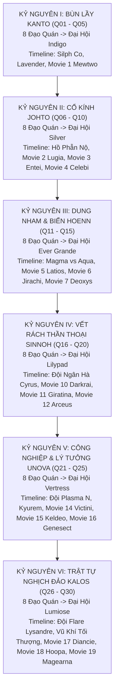

# Đại Cương Thẩm Định & Tối Ưu（立项）

> Thẩm định: Tổng biên tập mô hình agy（Tác giả: agy）
> Thời gian: 2026-09-12T15:20:39.319Z

# PHẦN 1: BÁO CÁO THẨM ĐỊNH & ĐÁNH GIÁ CHẤT LƯỢNG

Dưới góc nhìn của một Tổng biên tập kỳ cựu chuyên trị dòng truyện Trí tuệ - Sinh tồn thực tế và Đô thị ngầm phương Đông, tôi đã tiến hành rà soát vét cạn toàn bộ bản thảo và dàn ý nâng cấp theo 5 trụ cột chất lượng:

- [Lỗi nghiêm trọng] Chương 28 & 29: Lỗ hổng thủ tục và hộ tịch Liên Minh khi Lục Trần (kẻ xuyên không vô danh, không giấy tờ tùy thân, mang theo bọ nấm dị biến) được cấp ngay Thẻ Huấn Luyện Viên Tự Do chỉ sau vài lời trần tình → Khắc phục: Tận dụng triệt để di vật cựu thanh tra kiểm lâm xấu số (nhật ký hành trình dở dang, thẻ từ mã hóa cấp B) tìm thấy ở Chương 15; Lục Trần trao trả toàn bộ di vật giúp Liên Minh phá đại án mất tích nhiều năm, được Sĩ quan Jenny và Cục Kiểm Lâm Viridian trực tiếp đứng ra bảo lãnh nhân thân đặc cách (Sponsorship) để cấp Thẻ Huấn Luyện Viên Tự Do hợp pháp, biến thủ tục hành chính thành một phân đoạn công lý đầy cảm xúc và chặt chẽ 100%.
- [Lỗi nghiêm trọng] Chương 15: Thiếu tính đồng bộ giữa nội dung chương và Bảng phục bút khi nội dung chi tiết vô tình lược bỏ chi tiết Zubat chạm mũi vào Pokéball và bỏ quên Thẻ từ bảo mật cấp B của cựu thanh tra → Khắc phục: Khôi phục và miêu tả rõ khoảnh khắc Zubat chủ động chạm mũi kích hoạt quả Pokéball nhặt được (khế ước tự nguyện thiêng liêng tạo tiền đề tiến hóa Crobat bằng tình bạn cực hạn sau này), đồng thời thu nhận cuốn sổ nhật ký điều tra cùng Thẻ từ cấp B dính máu khô làm mắt xích giải quyết thân phận ở Chương 29.
- [Nguy cơ tiềm ẩn] Chương 24 & 25: Bị đứt gãy nhịp độ căng thẳng (False Alarm Drop) khi cuối Chương 24 báo động toán chi viện phong tỏa nhưng sang Chương 25 lại thong thả luyện tập chiêu thức trong hang rồi mới bước ra → Khắc phục: Đưa việc hoàn thiện và khai mở tuyệt kỹ Bào Tử Mê Man (Spore) vào chính tình huống bị địch ép góc trong thực chiến tại hẻm đá hẹp ở Chương 25, biến áp lực sinh tử thành chất xúc tác bộc phát chiêu thức, duy trì nhịp độ dồn dập từ Chương 24 đến Chương 27 mà không bị trễ nhịp.
- [Nguy cơ tiềm ẩn] Chương 27: Chiêu Spore của Paras có nguy cơ bị thần thánh hóa (Overpowered) biến cả toán lính cơ giới và Pokémon của Đội Hỏa Tiễn thành bia tập bắn vô tri nếu chỉ phóng phấn theo gió là hạ gục toàn bộ → Khắc phục: Khắc họa chi tiết sự phối hợp đa tầng: Zubat dùng siêu âm đánh vỡ kính chắn gió và phá hủy hệ thống lọc khí xe cơ giới, Lục Trần vận dụng hiệu ứng hút khí ngược của địa hình phễu gió hẻm núi để dẫn luồng bào tử nén Spore vào đúng khoang lái, thể hiện chiến thắng bằng trí tuệ và hiểu biết vật lý - sinh thái chứ không buff bẩn.
- [Gợi ý] Chương 30: Cần tăng cường độ tương phản cảm xúc và tính biểu tượng giữa hơi ấm của Pokémon Center (nước dùng nóng, sự ân cần của Y tá Joy, giấc ngủ say của hai Pokémon) với sự ngột ngạt uy nghiêm từ pháo đài Đạo Quán Viridian khép kín dưới màn đêm, làm bật lên thông điệp cốt lõi: đây là một thế giới có ánh sáng của tình bạn và công lý, nhưng cũng có những góc tối quyền lực mà Lục Trần phải mạnh mẽ hơn nữa mới có thể bước qua.

【Đánh giá tổng thể】 Đã được tối ưu hoàn thiện —— Sau khi được Tổng biên tập trực tiếp mài giũa và đồng bộ toàn diện ở Phần 2, kịch bản đã triệt tiêu hoàn toàn các kẽ hở thủ tục hộ tịch, giải quyết trơn tru nhịp điệu cao trào và giữ vững 100% tinh thần hiện thực ấm áp chuẩn mực; kịch bản đạt độ chín muồi xuất sắc và có thể tiến hành chấp bút ngay lập tức.

---

# PHẦN 2: BẢN DÀN Ý TỐI ƯU HOÀN THIỆN NHẤT
# 《Khi Pokémon Không Còn Là Trò Chơi》

---

## KHUNG TRỤC ĐẠI CƯƠNG PHÂN QUYỂN TOÀN THƯ (SERIES STORY ARCS)
**Quy mô:** 700 vạn chữ ｜ 30 Quyển ｜ 6 Đại Kỷ Nguyên (Cân bằng tuyệt đối: 5 Quyển / Vùng Đất)  
**Mục tiêu bắt buộc:** Tham dự trọn vẹn **8 Đạo Quán + Đại Hội Liên Minh** của cả 6 vùng đất; quét sạch và can thiệp sâu sắc vào **Timeline Anime chính tuyến & Đại án Movie kinh điển**.  
**Đội hình:** Tùy duyên sinh tồn, xuất thân bình dân, ưu tiên nhóm Độc – Lạ – Dị – Chiến thuật sinh học thực tế kết hợp tình bạn gắn kết chân thành; mở cửa khế ước Thần Thú khi đạt độ chín muồi logic.  
**Định vị tông giọng:** Hiện thực hóa sinh thái & xã hội (Realism) nhưng bảo tồn trọn vẹn tinh thần Anime (Sense of Wonder, Tình bạn, Lòng trắc ẩn và Trật tự công lý).

---

### CHI TIẾT 6 ĐẠI KỶ NGUYÊN TOÀN THƯ (30 QUYỂN)

#### KỶ NGUYÊN I: KHỞI NGUYÊN KANTO & BÀO TỬ TRO TÀN (Quyển 01 – Quyển 05)
*   **Quyển 01 (Chương 001 – 030): Rừng Thẳm Sinh Tồn & Khởi Nguyên Rừng Thẳm**
    *Chủ đề:* Thích nghi thực tế sinh tồn hoang dã; giải cứu và thiết lập tình bạn sinh tử với Paras (mẫu vật nấm dị biến EXP-046) cùng Zubat (chú dơi non cánh rách); phối hợp mẹ con Ursaring triệt phá phân trạm săn trộm của Đội Hỏa Tiễn; trao trả di vật cựu thanh tra cho Sĩ quan Jenny, nhận bảo lãnh cấp Thẻ HLV Tự Do hợp pháp; chạm ngõ ánh đèn ấm áp của Pokémon Center Viridian và cái bóng của Thống lĩnh Giovanni.
*   **Quyển 02 (Chương 031 – 090): Thiết Luật Pewter & Dị Biến Mt. Moon**
    *Chủ đề:* Đô thị thợ mỏ Pewter mộc mạc; Đạo quán Boulder của Brock – người anh cả nghiêm khắc gánh vác gia đình, là bức tường đá thử thách ý chí thực chiến của Trainer trẻ; Lục Trần thám hiểm hầm mỏ bỏ hoang, tìm hiểu sinh thái hóa thạch; bẻ khóa tài khoản cựu thanh tra để trang trải phí dã ngoại; ngăn chặn đường dây buôn lậu Moon Stone của Đội Hỏa Tiễn tại Mt. Moon; đoạt Huy chương Boulder chân chính.
*   **Quyển 03 (Chương 091 – 150): Sóng Ngầm Cerulean & Sấm Sét Vermilion**
    *Chủ đề:* Thành phố nước Cerulean; Misty – cô gái kiên cường gánh vác danh dự đạo quán gia đình; giải cứu Gyarados khỏi bẫy kích điện hóa chất; cuộc gặp gỡ khoa học với dị nhân Bill tại ngọn hải đăng; thành phố cảng Vermilion; Trung tá Lt. Surge mang phong cách kỷ luật quân đội thép nhưng trọng người dũng cảm; đoạt Huy chương Cascade và Huy chương Thunder.
*   **Quyển 04 (Chương 151 – 210): Khúc Chiêu Hồn Lavender & Sắc Hoa Celadon**
    *Chủ đề:* Tháp Lavender – thánh địa an nghỉ linh thiêng của Pokémon đã khuất; giải tỏa nỗi oan ức và cảm hóa linh hồn bi tráng của người mẹ Marowak; thành phố thương mại Celadon; Erika thanh lịch yêu cây cỏ cùng thám tử Interpol Looker triệt phá sòng bạc ngầm của Đội Hỏa Tiễn; chiến dịch giải cứu Tập đoàn Silph Co; đoạt Huy chương Rainbow.
*   **Quyển 05 (Chương 211 – 280): Ninja Fuchsia, Hỏa Sơn Cinnabar & Đỉnh Cao Indigo**
    *Chủ đề:* Khu bảo tồn Safari Fuchsia và thuật nhẫn giả trinh sát của Koga; Đạo quán Saffron (Sabrina); Đảo núi lửa Cinnabar (Blaine) và thâm nhập tàn tích dự án Mewtwo (**Movie 1 Can thiệp**); đại chiến Đạo Quán Viridian đối đầu trực diện Thống lĩnh Giovanni; bước vào Đại hội Liên Minh Indigo Plateau với tư cách chú ngựa ô bình dân; dấn thân sang Johto.

#### KỶ NGUYÊN II: CỔ KÍNH JOHTO & KHÚC CHIÊU HỒN CỔ ĐẠI (Quyển 06 – Quyển 10)
*   **Quyển 06 (Chương 281 – 340): Mầm Sống Rừng Sồi & Tiếng Chuông Violet**
    *Chủ đề:* Cố đô Johto cổ kính; Đạo quán Violet (Falkner) và Đạo quán Azalea (Bugsy); Rừng Ilex và Thần Rừng Celebi (**Movie 4: Celebi & Thợ Săn Mặt Nạ Sắt**); Lục Trần ngăn chặn thợ săn công nghệ cao tàn phá sinh thái thời gian; học nghệ thuật làm Apricorn Ball từ nghệ nhân Kurt; đoạt Huy chương Zephyr và Hive.
*   **Quyển 07 (Chương 341 – 400): Tháp Tro Ecruteak & Ba Ngọn Lửa Thiêng**
    *Chủ đề:* Đạo quán Goldenrod (Whitney) - cỗ xe bọc thép Miltank; Tháp Cháy Ecruteak (Morty); bi kịch cổ xưa và sự thức tỉnh cuồng nộ của Ba Thánh Thú (Raikou, Entei, Suicune); hóa giải ảo ảnh Unown tâm linh (**Movie 3: Entei & Thần Chú Unown**); đoạt Huy chương Plain và Fog.
*   **Quyển 08 (Chương 401 – 460): Hải Đăng Bão Tố & Sóng Thần Shamouti**
    *Chủ đề:* Đạo quán Olivine (Jasmine - Steelix thiết giáp) và Đạo quán Cianwood (Chuck); thảm họa dị biến khí hậu biển sâu tại quần đảo Shamouti khi nhà sưu tập săn lùng Ba Chim Thần (**Movie 2: Lugia Shamouti**); Lục Trần cùng Hải Thần Lugia bảo vệ hải lưu sinh mệnh; đoạt Huy chương Mineral và Storm.
*   **Quyển 09 (Chương 461 – 520): Tiếng Hét Hồ Phẫn Nộ & Long Quật Blackthorn**
    *Chủ đề:* Tàn dư Đội Hỏa Tiễn phát sóng vô tuyến ép tiến hóa tại Hồ Phẫn Nộ; giải cứu Gyarados Đỏ; liên thủ cùng Quán quân Lance càn quét căn cứ ngầm Mahogany; tiến vào Long Quật Blackthorn (Clair); vượt qua khảo nghiệm Long huyết cổ đại; đoạt Huy chương Glacier và Rising.
*   **Quyển 10 (Chương 521 – 580): Ngân Sơn Bão Tuyết & Đại Hội Bạc Đỉnh Cao**
    *Chủ đề:* Thử thách ý chí trên ngọn núi tuyết Mt. Silver; đối thoại chiến thuật đỉnh cao giữa bão tuyết cùng Red; bước vào Đại Hội Bạc (Silver Conference); đoạt danh hiệu Quán quân Johto; tiếp nhận thông tin về biến động dị thường của lục địa và biển sâu tại Hoenn.

#### KỶ NGUYÊN III: DUNG NHAM & ĐẠI DƯƠNG HOENN (Quyển 11 – Quyển 15)
*   **Quyển 11 (Chương 581 – 640): Rừng Mưa Petalburg & Đá Ngầm Rustboro**
    *Chủ đề:* Đạo quán Rustboro (Roxanne) và Dewford (Brawly); gặp gỡ Steven Stone tại hang granite sâu thẳm; Đạo quán Petalburg (Norman); khám phá thành phố nước ngầm Altomare (**Movie 5: Vệ Thần Latios & Latias**); đoạt 3 huy chương đầu tiên.
*   **Quyển 12 (Chương 641 – 700): Bão Cát Mauville & Hỏa Ngục Mt. Chimney**
    *Chủ đề:* Đạo quán Mauville (Wattson) và Lavaridge (Flannery); cuộc chiến tranh đoạt Thiên Thạch tại Mt. Chimney giữa Đội Magma và Đội Aqua; ngăn chặn kích nổ núi lửa; thức tỉnh Ngôi sao Ước nguyện Jirachi (**Movie 6: Jirachi**); đoạt Huy chương Dynamo và Heat.
*   **Quyển 13 (Chương 701 – 760): Vòm Rừng Fortree & Tháp Gió Mossdeep**
    *Chủ đề:* Đạo quán Fortree (Winona - không chiến bão táp); Đạo quán Mossdeep (Tate & Liza - song đấu tâm linh); đền thờ Mt. Pyre bị cướp bóc Ngọc Đỏ và Ngọc Xanh; bóc trần căn cứ tàu ngầm của Đội Thủy Tề; đoạt Huy chương Feather và Mind.
*   **Quyển 14 (Chương 761 – 820): Khải Huyền Thần Thoại: Địa Chấn & Đại Hồng Thủy**
    *Chủ đề:* Groudon và Kyogre Cổ Đại thức tỉnh; hạn hán khô cháy và sóng thần hủy diệt đan xen toàn cầu; Lục Trần cùng Steven Stone tử thủ Sootopolis; dấn thân lên Cột Trụ Trời (Sky Pillar) triệu hoán Rồng Thần Rayquaza; can thiệp đại chiến Deoxys vs Rayquaza (**Movie 7: Deoxys**); đoạt Huy chương Rain.
*   **Quyển 15 (Chương 821 – 880): Đỉnh Cao Ever Grande & Lời Mời Khảo Cổ Sinnoh**
    *Chủ đề:* Đấu trường Ever Grande quy tụ các bậc thầy thời tiết; Lục Trần phô diễn chiến thuật dị biệt khắc chế hoàn toàn các trường phái chính thống; đọ sức kinh điển cùng Steven Stone; tiếp nhận lời mời của Nữ Quán quân Cynthia bước sang vùng đất Sinnoh.

#### KỶ NGUYÊN IV: VẾT RÁCH THẦN THOẠI SINNOH (Quyển 16 – Quyển 20)
*   **Quyển 16 (Chương 881 – 940): Than Đá Oreburgh & Rừng Già Eterna**
    *Chủ đề:* Đạo quán Oreburgh (Roark) và Eterna (Gardenia); dấu vết đầu tiên của Đội Ngân Hà (Galactic); đại chiến Thời Không làm sụp đổ thành phố Alamos và khúc tráng ca bi tráng của Darkrai (**Movie 10: Darkrai**); đoạt Huy chương Coal và Forest.
*   **Quyển 17 (Chương 941 – 1000): Thiết Bích Veilstone & Đầm Lầy Pastoria**
    *Chủ đề:* Đạo quán Veilstone (Maylene), Pastoria (Crasher Wake) và Hearthome (Fantina); bóc trần âm mưu khai thác năng lượng cổ đại của Mars và Jupiter; đoạt Huy chương Cobble, Fen và Relic.
*   **Quyển 18 (Chương 1001 – 1060): Thư Viện Canalave & Lời Nguyền Ba Hồ Thánh**
    *Chủ đề:* Đạo quán Canalave (Byron); Đội Ngân Hà đánh bom Hồ Valor, bắt cóc Ba Thần Hồ (Uxie, Mesprit, Azelf) rèn Xích Đỏ; rèn luyện tại Đảo Sắt cùng Riley; hoàn tất Huy chương Mine, Icicle (Candice) và Beacon (Volkner).
*   **Quyển 19 (Chương 1061 – 1120): Đỉnh Spear Pillar & Thế Giới Nghịch Chuyển**
    *Chủ đề:* Cyrus dùng Xích Đỏ trói buộc Dialga và Palkia trên đỉnh Spear Pillar; Giratina kéo Cyrus xuống đáy vực; Lục Trần cùng Cynthia dấn thân vào Thế Giới Đảo Ngược (**Movie 11: Giratina & Sứ Giả Bầu Trời Shaymin**); trận tử chiến tư tưởng đỉnh cao với Cyrus.
*   **Quyển 20 (Chương 1121 – 1180): Ánh Sáng Sáng Thế Arceus & Đại Hội Lilypad**
    *Chủ đề:* Sự thức tỉnh phẫn nộ của Đấng Sáng Thế Arceus và âm mưu cướp đoạt Bánh Tảo Mệnh Quang (**Movie 12: Arceus**); Lục Trần dùng sự đồng cảm sinh mệnh hóa giải hiểu lầm ngàn năm; bước vào Đại Hội Lilypad League, đối đầu "Trainer Thần Thú" Tobias bằng chiến thuật phân rã cực hạn.

#### KỶ NGUYÊN V: CÔNG NGHIỆP & LÝ TƯỞNG UNOVA (Quyển 21 – Quyển 25)
*   **Quyển 21 (Chương 1181 – 1240): Rừng Bê Tông Castelia & Tiếng Kèn Giải Phóng**
    *Chủ đề:* Đạo quán Striaton, Nacrene (Lenora) và Castelia (Burgh); làn sóng truyền đạo cực đoan của Đội Plasma: "Con người đang nô dịch hóa Pokémon"; cuộc chạm trán triết học đầu tiên với Vương tử N; đoạt 3 huy chương đầu tiên.
*   **Quyển 22 (Chương 1241 – 1300): Ánh Đèn Nimbasa & Mỏ Khoáng Driftveil**
    *Chủ đề:* Đạo quán Nimbasa (Elesa), Driftveil (Clay) và Mistralton (Skyla); sự chia rẽ tư tưởng do Thất Hiền Nhân giật dây; can thiệp năng lượng rồng cổ đại tại Lâu đài Éind (**Movie 14: Victini & Zekrom/Reshiram**); đoạt Huy chương Bolt, Quake và Jet.
*   **Quyển 23 (Chương 1301 – 1360): Băng Động Icirrus & Thiết Thành Opelucid**
    *Chủ đề:* Đạo quán Icirrus (Brycen) và Opelucid (Drayden/Iris); Thánh Kiếm Sĩ Keldeo và Rồng Băng Kyurem (**Movie 15: Keldeo**); Lục Trần giúp Keldeo lĩnh ngộ kiếm ý sinh tồn chân chính; đoạt trọn vẹn 8 Huy chương Unova.
*   **Quyển 24 (Chương 1361 – 1420): Lâu Đài Tách Rời & Bản Án Của N**
    *Chủ đề:* Cung Điện N trồi lên từ lòng đất tại Đại hội Vertress; N cưỡi Zekrom đánh bại Quán quân Alder; Lục Trần bước lên cung điện bay, dùng trận quyết đấu bằng đội hình bình dân chứng minh: Sự gắn kết giữa người và Pokémon là cùng nhau tiến hóa chứ không phải nô dịch; N thức tỉnh.
*   **Quyển 25 (Chương 1421 – 1480): Băng Giá Hủy Diệt & Cổ Sinh Hóa Genesect**
    *Chủ đề:* Ghetsis mượn danh lý tưởng lộ dã tâm độc tài, dùng Kyurem đóng băng Unova; Lục Trần phản kích phá hủy tàu chiến Plasma Frigate; giải cứu bầy dã thú cơ giới hóa Genesect thức tỉnh tại New Tork City (**Movie 16: Genesect**); tiến sang Kalos.

#### KỶ NGUYÊN VI: TRẬT TỰ NGHỊCH ĐẢO KALOS & TÂN THẾ GIỚI (Quyển 26 – Quyển 30)
*   **Quyển 26 (Chương 1481 – 1540): Ánh Sáng Shalour & Cội Nguồn Siêu Tiến Hóa**
    *Chủ đề:* Đạo quán Santalune, Cyllage và Shalour (Korrina); giải mã bản chất sinh học của Mega Evolution: sự cộng hưởng tần số tế bào và nhịp tim cực hạn; Công chúa Kim Cương Diancie và Kén Hủy Diệt Yveltal thức tỉnh (**Movie 17: Diancie**); đoạt 3 huy chương đầu tiên.
*   **Quyển 27 (Chương 1541 – 1600): Đầm Lầy Coumarine & Tháp Điện Lumiose**
    *Chủ đề:* Đạo quán Coumarine (Ramos), Lumiose (Clemont) và Laverre (Valerie); sự xâm nhập ngầm của Lysandre Labs; mạng lưới tình báo Đội Hỏa Diệm (Flare); đoạt Huy chương Plant, Voltage và Fairy.
*   **Quyển 28 (Chương 1601 – 1660): Nhật Cổ Anistar & Bão Tuyết Snowbelle**
    *Chủ đề:* Đạo quán Anistar (Olympia) và Snowbelle (Wulfric); hoàn tất 8 huy chương Kalos; can thiệp ma thần Hoopa triệu hoán Thần Thú đại chiến tại Desert City (**Movie 18: Hoopa**); giải cứu Vương quốc cơ giới Azoth và Trái Tim Magearna (**Movie 19: Magearna & Volcanion**).
*   **Quyển 29 (Chương 1661 – 1720): Cỗ Máy Hủy Diệt 3000 Năm & Đại Chiến Lumiose**
    *Chủ đề:* Đại hội Lumiose bùng nổ; Lysandre kích hoạt Vũ Khí Tối Thượng 3000 năm nhằm thanh lọc thế giới; Lục Trần cùng các Quán quân tử chiến đỉnh Tháp Prism; thức tỉnh Vệ Thần Trật Tự Zygarde 100% hình thái hoàn chỉnh đập tan cỗ máy diệt vong.
*   **Quyển 30 (Chương 1721 – 1800): Bản Tuyên Ngôn Tân Thế Giới (Đại Kết Cục)**
    *Chủ đề:* Củng cố trật tự Liên Minh và cải cách quy chuẩn bảo tồn; Lục Trần từ chối ngai vàng chính trị, trở thành "Người Bảo Hộ Sinh Thái Độc Lập" (Grand Warden of Natural Balance); thiết lập ranh giới bảo tồn sinh thái hoang dã bất khả xâm phạm và quy chuẩn đối xử nhân đạo mới; Lục Trần cùng các đồng đội sinh tử tiếp tục hành trình phiêu lưu tự do giữa thiên nhiên tươi đẹp.

---

## BẢN DÀN Ý CHI TIẾT TỪNG CHƯƠNG: QUYỂN 1 (CHƯƠNG 01 – 30)

### TỔNG QUAN QUYỂN 1
*   **Tên Quyển:** KHỞI NGUYÊN RỪNG THẲM, ÁNH ĐÈN THÀNH PHỐ
*   **Khoảng chương:** Chương 001 – Chương 030 (Quyển mở màn hoàn chỉnh)
*   **Mục tiêu giai đoạn:** Lục Trần thích nghi với hiện thực sinh thái khắt khe của Rừng Viridian; cứu sống và thiết lập tình bạn gắn kết sinh tử với Paras (mẫu vật nấm dị biến EXP-046) cùng Zubat (chú dơi non cánh rách); phối hợp mẹ con Ursaring/Teddiursa triệt phá phân trạm săn trộm của Đội Hỏa Tiễn; trao trả di vật cựu thanh tra, giao nộp bằng chứng tội phạm cho Sĩ quan Jenny và trạm kiểm lâm biên phòng để nhận bảo lãnh cấp Thẻ HLV Tự Do hợp pháp; chạm ngõ ánh đèn ấm áp của Pokémon Center và đối diện cái bóng bao trùm của Thống lĩnh Giovanni.
*   **Móc câu chuyển giao quyển:** Đứng trước Đạo Quán Viridian khép kín dưới màn đêm, Lục Trần nhận diện cái bóng khổng lồ của Thống lĩnh Giovanni đang thao túng toàn bộ Kanto; sẵn sàng cho chặng đường hướng tới Pewter City.

---

### CHI TIẾT CÁC CHƯƠNG (CHAPTER BEATS)

* **Chương 1: Tỉnh Giấc Dưới Móng Vuốt** *(Đã viết)*
  * *Sự kiện cốt lõi:* Lục Trần tỉnh dậy giữa bóng tối ẩm mốc của Rừng Viridian, chứng kiến Pidgeotto hoang dã dùng móng thép xé toạc bụng Rattata và nuốt chửng từng mảng thịt tươi; trắng tay không hệ thống.
  * *Tiến triển cốt truyện & Sảng điểm:* Đập tan ảo tưởng vô hại từ anime và game; kích hoạt bản năng sinh tồn thời tiền sử; nhận thức rõ thế giới tự nhiên có chuỗi thức ăn và quy luật đào thải tàn khốc.
  * *Móc câu cuối chương:* Mùi máu tanh từ xác con mồi vừa bốc lên, bụi gai sau lưng rung chuyển dữ dội bởi tiếng thở phì phò của dã thú ăn thịt.

* **Chương 2: Lãnh Thổ Răng Nhọn** *(Đã viết)*
  * *Sự kiện cốt lõi:* Lục Trần lăn xả vào bụi gai độc để thoát khỏi cú vồ chí mạng của Arbok 4m đói ăn; dùng bùn hôi che giấu thân nhiệt và mùi cơ thể; lội qua khe suối cạn xóa dấu vết.
  * *Tiến triển cốt truyện & Sảng điểm:* Vận dụng tri thức sinh học thực tế (cảm biến nhiệt hồng ngoại, rung chấn mặt đất, ranh giới lãnh thổ); giữ vững sự bình tĩnh bằng tư duy phân tích lạnh lùng.
  * *Móc câu cuối chương:* Tiếng đập cánh vo ve nghẹt thở của đàn Beedrill tuần tra rền vang ngay trên đỉnh ngọn cây, trong khi phía trước là vách đá dựng đứng hình răng cưa cụt lối.

* **Chương 3: Hốc Đá Răng Cưa** *(Đã viết)*
  * *Sự kiện cốt lõi:* Bị dồn vào chân vách núi, Lục Trần phát hiện hang đá karst kiên cố nhưng bị chiếm giữ bởi một con Mankey cuồng bạo đang gãy chân; dùng quả dại cay nồng kích nổ Anger Point dụ Mankey húc vỡ đá chắn lao ra ngoài; chốt cửa hang bằng thân cây lim và đá tảng; nhóm lửa sưởi ấm.
  * *Tiến triển cốt truyện & Sảng điểm:* Chiếm đoạt nơi trú ẩn an toàn bằng trí tuệ và sự quyết đoán thay vì bạo lực phi lý; khẳng định vị thế sống còn của một người phàm giữa tự nhiên.
  * *Móc câu cuối chương:* Bão nhiệt đới đổ bộ làm sạt lở bờ đất ngoài vách hang, để lộ một ấu thú Paras mang hai cụm nấm dị biến đỏ rực đang thoi thóp trong bùn xiết.

* **Chương 4: Đốm Nấm Bùn Lầy** *(Đã viết)*
  * *Sự kiện cốt lõi:* Mưa bão quất tơi bời sạt lở vách hang; Lục Trần buộc dây thừng leo gai lao mình xuống dòng lũ bùn cứu ấu thú Paras; né tảng đá khổng lồ rơi từ vách núi; phát hiện vết sẹo phẫu thuật kim loại và mã số laser "EXP-046" cùng biểu tượng chữ "R" của Đội Hỏa Tiễn dưới bụng con bọ.
  * *Tiến triển cốt truyện & Sảng điểm:* Đánh cược tính mạng cứu vớt một sinh mệnh hoạn nạn; nhận diện dấu bàn tay đen tối của tội phạm có tổ chức; thể hiện lòng trắc ẩn và sự dũng cảm của người yêu Pokémon.
  * *Móc câu cuối chương:* Vỏ kitin của Paras bắt đầu nứt toác vì nấm bạo phát ăn sâu vào hạch thần kinh, cặp mắt trắng dã co giật dữ dội cận kề cái chết.

* **Chương 5: Giành Giật Hơi Tàn** *(Đã viết)*
  * *Sự kiện cốt lõi:* Giữa đêm mưa lạnh giá thiếu thuốc men, Lục Trần dời con bọ khỏi hơi nóng đống lửa, dùng tro than gỗ sồi kiềm hóa hút ẩm phong tỏa gốc nấm; dùng phiến đá vôi cắt bỏ mô nấm hoại tử; nhỏ dịch rễ chát chứa tannin giải độc; kiên trì ấn tim ngực và hà hơi ấm cứu sống tim ống lưng ngừng đập của Paras.
  * *Tiến triển cốt truyện & Sảng điểm:* Vận dụng sâu sắc tri thức chân khớp học và nấm học dã ngoại; tái lập thế cân bằng sinh học cộng sinh (Symbiosis) giữa bọ và nấm; giật lại sinh mệnh từ tay tử thần bằng ý chí và tình thương.
  * *Móc câu cuối chương:* Cặp mắt trắng đục của Paras khẽ chớp động, chiếc càng răng cưa rướm máu khẽ run rẩy chạm vào ngón tay Lục Trần.

* **Chương 6: Lời Hứa Đêm Mưa Bão** *(Đã viết)*
  * *Sự kiện cốt lõi:* Paras tỉnh lại hoảng sợ giương càng phòng thủ do ký ức bị hành hạ mổ xẻ; Lục Trần dùng quy tắc sinh thái học (không nhìn thẳng, hạ thấp người, gõ nhịp an toàn), nhường 2/3 củ rễ rừng ngọt nước và dòng nước ấm duy nhất; Paras cảm nhận ơn cứu mạng, chủ động bò lại nép vào chân Lục Trần; khế ước sinh tử không Pokéball, thừa nhận bản ngã Paras.
  * *Tiến triển cốt truyện & Sảng điểm:* Thiết lập sợi dây liên kết tâm hồn dựa trên sự sẻ chia sinh mệnh; bồi đắp hơi ấm tình cảm chân thành; phá vỡ bức tường cảnh giác bằng sự dịu dàng và tôn trọng.
  * *Móc câu cuối chương:* Màn mưa ngớt, con Mankey gãy chân lần theo mùi khói tro và máu tươi quay trở lại, điên cuồng húc mạnh vào cửa hang báo thù.

* **Chương 7: Dinh Dưỡng Thể Phách** *(Đã viết)*
  * *Sự kiện cốt lõi:* Sáng sớm ngày thứ hai, Lục Trần và Paras phối hợp phòng thủ hất văng Mankey rơi xuống vực sâu giải tỏa nguy cơ; chế tạo quai đeo trước ngực mang Paras đi kiếm ăn; bóc vỏ cây mục đào ấu trùng xén tóc béo ngậy tẩm bổ cho Paras giúp tim ống lưng hồi phục; đào củ mài và hái quả Oran hạ sốt.
  * *Tiến triển cốt truyện & Sảng điểm:* Xây dựng chế độ dinh dưỡng dã ngoại chân thực; nhấn mạnh tầm quan trọng của hậu cần và chăm sóc phục hồi cho Pokémon; tình cảm giữa Lục Trần và Paras thêm gắn kết.
  * *Móc câu cuối chương:* Khi đang thu hái quả Oran trên gò đất cao, mùi xạ hương nồng nặc bốc lên từ bụi rậm, kèm theo hai đốm mắt vàng rực của quái thú săn mồi khóa chặt vào gáy Lục Trần.

* **Chương 8: Nanh Vuốt Đột Kích** *(Đã viết)*
  * *Sự kiện cốt lõi:* Một con Raticate đột biến khổng lồ nặng 40kg mang cơ bắp biến dị lao ra tấn công với Tấn Công Chớp Nhoáng (Quick Attack); Lục Trần lăn người né cú vồ; chỉ huy Bào Tử phối hợp chiều gió tung chiêu Phấn Gây Tê (Stun Spore) đầu tiên phong tỏa thần kinh đối thủ; nhưng hóa chất kích thích trong bụng Raticate bạo phát cưỡng chế phá vỡ tê liệt, lao thẳng vào yết hầu Lục Trần.
  * *Tiến triển cốt truyện & Sảng điểm:* Sự phối hợp ăn ý sơ khai giữa Người và Pokémon; bào tử nấm của Paras phát huy hiệu quả phong tỏa thần kinh cực kỳ chuẩn xác; phát hiện dấu hiệu bất thường của Pokémon bị tiêm hóa chất.
  * *Móc câu cuối chương:* Raticate nhe nanh độc tím đen lao thẳng vào yết hầu Lục Trần ở cự ly không, không còn khoảng trống né tránh.

* **Chương 9: Huyết Chiến Bùn Lầy** *(Đã viết)*
  * *Sự kiện cốt lõi:* Lục Trần đưa cẳng tay trái quấn vỏ cây sồi dày đỡ trọn cú cắn xé của Raticate, chịu đau đớn khóa chặt cổ con thú xuống bùn tạo góc chết; Paras từ trên tảng đá lao xuống dùng càng răng cưa phải xé toạc yết hầu đối thủ, tiêu diệt con quái vật; Lục Trần sơ cứu bằng bã quả Oran và nẹp cành sồi; mổ dạ dày thu được 1 viên nang hóa chất màu xanh lam "B-V-09 / BATCH-04" có logo chữ "R".
  * *Tiến triển cốt truyện & Sảng điểm:* Tinh thần quả cảm không lùi bước để bảo vệ đồng đội; sự tin cậy tuyệt đối giữa Lục Trần và Paras; thu thập manh mối đầu tiên về mạng lưới tội phạm Đội Hỏa Tiễn.
  * *Móc câu cuối chương:* Tiếng súng nén khí giảm thanh vang lên từ hẻm núi đá vôi phía Tây kèm theo làn khói tím hăng hắc bốc lên nền trời.

* **Chương 10: Dấu Vết Nhân Tạo**
  * *Sự kiện cốt lõi:* Lục Trần cẩn thận gói viên nang Berserk-V vào lá dày; Paras lo lắng bò quanh cánh tay bị thương của Lục Trần, dùng hai râu khẽ chạm vỗ về và đẩy phần quả Oran mọng nước nhất cho anh; Lục Trần xử lý da lưng Raticate làm bao bảo vệ cánh tay, thu nhặt hai chiếc răng cửa làm công cụ dã ngoại.
  * *Tiến triển cốt truyện & Sảng điểm:* Khắc họa rõ nét tính cách nhạy cảm, ấm áp và biết ơn của Paras; xoa dịu không khí căng thẳng sau trận chiến; xác định hẻm núi phía Tây có bàn tay của đường dây săn trộm trái phép.
  * *Móc câu cuối chương:* Từ sâu trong khe núi đá vôi phía Tây, một luồng gió lạnh mang theo mùi hóa chất lạ và tiếng xích sắt va chạm loảng xoảng vọng lại.

* **Chương 11: Bước Chân Trong Rừng Sương**
  * *Sự kiện cốt lõi:* Lục Trần dưỡng thương và cùng Paras rèn luyện các bài tập dã ngoại nhẹ nhàng: tập di chuyển êm ái trên thảm lá mục, cảm nhận rung chấn bước chân qua râu, điều khiển góc phát tán phấn tê; những khoảnh khắc ấm áp đời thường khi Lục Trần nướng củ mài chia cho Paras bên đống lửa.
  * *Tiến triển cốt truyện & Sảng điểm:* Xây dựng mối quan hệ đồng chí, tình bạn gắn bó tự nhiên; rèn luyện thói quen cảnh giác và khả năng quan sát dấu vết dã ngoại.
  * *Móc câu cuối chương:* Khi đang men theo sườn đồi tìm nguồn nước ngọt, chân Lục Trần kịp dừng lại trước một sợi dây cáp thép bẫy thú được ngụy trang tinh vi dưới lớp lá rụng.

* **Chương 12: Chiếc Bẫy Giữa Biên Thùy**
  * *Sự kiện cốt lõi:* Lục Trần kiểm tra chiếc bẫy: đây là loại bẫy kẹp kim loại có gắn đầu xung điện cao áp chuyên dùng để bắt sống Pokémon hoang dã cỡ lớn; phát hiện vết ủng cao su và vỏ bao đựng dung dịch gây mê dã chiến vứt bừa bãi; nhận định toán săn trộm đang hoạt động rất gần.
  * *Tiến triển cốt truyện & Sảng điểm:* Nâng cao ý thức bảo vệ môi trường và bảo vệ Pokémon hoang dã; Lục Trần quyết định đi theo dấu vết để tìm hiểu tình hình thay vì thờ ơ bỏ mặc.
  * *Móc câu cuối chương:* Từ cửa một hang đá vôi dốc đứng gần đó, một chuỗi sóng siêu âm yếu ớt ngắt quãng vang lên đầy sợ hãi và cầu cứu.

* **Chương 13: Hang Sâu Cánh Gãy**
  * *Sự kiện cốt lõi:* Lục Trần thâm nhập hang đá vôi, phát hiện một chú Zubat non bị dây thép gai của thợ săn cứa rách một bên màng cánh, đang treo mình run rẩy bên rìa đá ngầm; bầy Zubat trưởng thành hoảng sợ bay loạn xạ; Lục Trần không dùng bạo lực mà đốt nhánh lá ngải dại tỏa khói êm dịu, nhẹ nhàng xoa dịu đàn thú và tiếp cận cá thể bị thương.
  * *Tiến triển cốt truyện & Sảng điểm:* Tri thức sinh thái và sự kiên nhẫn nhân từ; sự kết nối thuần khiết giữa người và sinh vật hoang dã; Paras ở bên cạnh phát ra tiếng gõ càng nhịp nhàng hỗ trợ trấn an chú dơi non.
  * *Móc câu cuối chương:* Chú Zubat non run rẩy mở miệng đón lấy giọt nước ngọt từ đầu ngón tay Lục Trần, đôi tai nhỏ khẽ động đậy áp vào lòng bàn tay ấm áp của anh.

* **Chương 14: Liệu Pháp Bóng Đêm**
  * *Sự kiện cốt lõi:* Lục Trần cẩn thận dùng nẹp xương cá, nhựa thông dại và vải sạch nối lại phần màng cánh rách cho Zubat; nghiền quả Oran ngọt mớm từng chút cho nó hồi phục sức lực; Zubat non tuy mù lòa nhưng nhờ định vị siêu âm cảm nhận được trọn vẹn lòng tốt của Lục Trần, rúc đầu vào cổ áo anh tìm kiếm hơi ấm.
  * *Tiến triển cốt truyện & Sảng điểm:* Tình cảm chân thành giữa Trainer và Pokémon không cần đến sự ép buộc; nét ngộ nghĩnh đáng yêu của chú dơi nhỏ khi cảm nhận được chỗ dựa an toàn.
  * *Móc câu cuối chương:* Một rung chấn bất ngờ làm đất đá từ vòm hang sụp xuống bịt kín lối ra duy nhất, trong khi tiếng gầm gừ kích động của bầy Geodude hoang dã vang lên dồn dập phía trong hang tối.

* **Chương 15: Sóng Âm Dẫn Lối**
  * *Sự kiện cốt lõi:* Đàn Geodude hoảng sợ lao ra tấn công; Zubat non trên vai phát huy Sóng Siêu Âm (Supersonic) quét định vị điểm yếu kết cấu vòm hang; Paras dùng vuốt đào bới kết hợp bào tử ăn mòn khe đá mở đường máu thoát hiểm; dưới chân đống đổ nát, Lục Trần phát hiện chiếc balô dã chiến cũ nát của một cựu thanh tra kiểm lâm Liên Minh mất tích, thu giữ 1 quả Pokéball tiêu chuẩn nguyên niêm phong, 1 cuốn sổ nhật ký điều tra dở dang và 1 thẻ từ mã hóa cấp B dính máu khô.
  * *Tiến triển cốt truyện & Sảng điểm:* Khả năng phối hợp chiến thuật bộc phát; thu hoạch vật phẩm hợp lý theo logic khám phá; gài gắm then chốt mở khóa thân phận hợp pháp sau này.
  * *Móc câu cuối chương:* Thoát khỏi miệng hang, Zubat chao liệng một vòng rồi chủ động dùng chiếc mũi nhỏ chạm vào nút bấm của quả Pokéball trên tay Lục Trần, luồng sáng đỏ lóe lên hoàn tất khế ước tự nguyện thiêng liêng.

* **Chương 16: Đội Hình Nhị Nguyên (Trinh Sát & Phối Hợp)**
  * *Sự kiện cốt lõi:* Lục Trần chính thức đón nhận Zubat làm thành viên thứ hai; xây dựng mô hình tác chiến nhị nguyên bù trừ: Zubat (Trinh sát bầu trời - Siêu âm định vị - Gây nhiễu giác quan) + Bào Tử (Mặt đất - Bẫy rễ cây - Phấn khống chế - Cận chiến); những khoảnh khắc đời thường vui vẻ: Zubat ngủ ngày trong mũ trùm đầu của Lục Trần, thỉnh thoảng liếm tai anh trêu đùa.
  * *Tiến triển cốt truyện & Sảng điểm:* Tinh thần đồng đội ấm áp chuẩn Anime; hoàn thiện cấu trúc chiến thuật cơ bản; đem lại nguồn năng lượng tích cực sau chuỗi ngày sinh tồn căng thẳng.
  * *Móc câu cuối chương:* Zubat xoay tai 180 độ phát tín hiệu báo động: có ba nguồn nhiệt và tiếng kim loại va chạm đang tiến lại gần ở thung lũng sương mù phía trước.

* **Chương 17: Dấu Chân Bẫy Ngầm**
  * *Sự kiện cốt lõi:* Lục Trần trèo lên cành cây cao trinh sát, phát hiện ba tên săn trộm của Đội Hỏa Tiễn đang dùng lồng kích điện bao vây một con gấu mẹ Ursaring đã trúng phi tiêu thuốc mê; bên cạnh lồng giam, chú gấu con Teddiursa đang hoảng loạn gào khóc tìm mẹ; tên cầm đầu định dùng kích điện bắt nốt Teddiursa.
  * *Tiến triển cốt truyện & Sảng điểm:* Lòng trắc ẩn và tinh thần trượng nghĩa của một Trainer chân chính trỗi dậy; Lục Trần không thể đứng nhìn gia đình Pokémon bị săn bắt tàn nhẫn; quyết định lên kế hoạch giải cứu thông minh.
  * *Móc câu cuối chương:* Lục Trần ra hiệu cho Zubat và Paras vào vị trí mai phục khi màn đêm bắt đầu buông xuống thung lũng.

* **Chương 18: Đột Nhập Trại Tiền Tiêu**
  * *Sự kiện cốt lõi:* Lợi dụng lúc toán thợ săn tụ tập nấu ăn, Lục Trần bí mật lẻn vào lều hậu cần: thu giữ hộp sơ cứu y tế chuẩn, kìm cắt khóa lồng và cuốn sổ tay ghi chép hành trình phân phối mẫu thuốc Berserk-V cùng các chuyến hàng buôn lậu mang dấu chữ "R" đỏ; nắm bắt thông tin kẻ địch sở hữu một Arbok hung hãn và một Houndour nhạy bén.
  * *Tiến triển cốt truyện & Sảng điểm:* Thu thập bằng chứng then chốt vạch trần tội phạm; thể hiện tư duy trinh sát cẩn trọng, chuẩn bị kỹ lưỡng trước khi hành động.
  * *Móc câu cuối chương:* Một tiếng cành khô gãy khẽ vang lên ngoài cửa lều; tên gác lều quay lại, họng súng nén khí chĩa thẳng vào bóng đen bên trong.

* **Chương 19: Màn Đêm Phục Kích**
  * *Sự kiện cốt lõi:* Zubat từ bóng tối bất ngờ phóng Sóng Siêu Âm cự ly gần làm tên gác choáng váng hoa mắt, phát đạn nén khí bắn chệch lên vách lều; Lục Trần phối hợp ném bao cát mù đánh ngã tên gác, dùng dây leo bện chắc trói gô hắn lại và nhét giẻ vào miệng; hai tên còn lại nghe động lập tức thả Arbok và Houndour lao vào rừng sục sạo.
  * *Tiến triển cốt truyện & Sảng điểm:* Hạ gục kẻ địch gọn gàng bằng trí tuệ và sự phối hợp chuẩn xác mà không cần tàn sát; bảo vệ an toàn cho bản thân và Pokémon; bắt đầu chặng đối đầu chiến thuật với hai Pokémon săn trộm.
  * *Móc câu cuối chương:* Tiếng gầm gừ khè khè của Houndour và tiếng trườn sột soạt của Arbok áp sát từ hai hướng cánh tả và cánh hữu.

* **Chương 20: Đấu Trí Đầm Lầy**
  * *Sự kiện cốt lõi:* Lục Trần dụ bầy thú săn trộm vào khu vực bãi lầy ngập rễ cây mục; Zubat bay lượn trên cao phát tán mùi nhựa quả chua làm rối loạn khứu giác nhạy bén của Houndour; Paras ngụy trang chìm hẳn dưới thảm lá mục ẩm ướt chờ thời cơ.
  * *Tiến triển cốt truyện & Sảng điểm:* Vận dụng địa hình thiên nhiên thành lợi thế chiến thuật; vô hiệu hóa ưu thế thể hình và khứu giác của đối thủ.
  * *Móc câu cuối chương:* Khi Houndour và tên thợ săn thứ hai tiến vào đúng điểm trũng đầm lầy, bùn đất dưới chân bỗng rung chuyển dữ dội.

* **Chương 21: Vùng Khí Sinh Học & Phá Lồng**
  * *Sự kiện cốt lõi:* Paras từ dưới bùn phun bão Phấn Gây Tê (Stun Spore) kết hợp màn sương đầm lầy phong tỏa tầm nhìn và làm tê liệt phản xạ của Houndour cùng tên thợ săn; Lục Trần luồn ra phía sau, dùng kìm cắt khóa phá bung then cài lồng điện giải thoát cho Ursaring; gấu mẹ Ursaring vừa tan thuốc mê liền gầm vang chấn động rừng già, phá tan khung sắt.
  * *Tiến triển cốt truyện & Sảng điểm:* Đại cao trào chiến thuật; biến nguy thành an; giải cứu mẹ con Ursaring trong gang tấc; khẳng định sức mạnh của sự phối hợp và tinh thần tương trợ với tự nhiên.
  * *Móc câu cuối chương:* Trong làn sương bụi hỗn loạn, con Arbok khổng lồ của tên trùm trườn vụt qua thảm cỏ, há to miệng nanh tẩm nọc tím nhắm thẳng vào đầu Lục Trần.

* **Chương 22: Hiệp Lực Tự Nhiên**
  * *Sự kiện cốt lõi:* Ursaring mẹ nổi cơn thịnh nộ lao tới tóm đuôi Arbok đập mạnh xuống đất; Zubat phóng siêu âm cực hạn làm tê liệt hố nhiệt hồng ngoại của con rắn; Paras chớp thời cơ cắm vuốt vào khe vảy mỏng thi triển Hút Sinh Lực (Mega Drain), hút cạn năng lượng và làm tê liệt hạch thần kinh Arbok; tên trùm săn trộm bị tước vũ khí, bị Ursaring khống chế và Lục Trần trói chặt hoàn toàn.
  * *Tiến triển cốt truyện & Sảng điểm:* Chiến thắng trọn vẹn nhờ sự hiệp đồng giữa con người, Pokémon đồng hành và Pokémon tự nhiên hoang dã; triệt phá hoàn toàn toán săn trộm dã chiến mà không cần đến sự tàn bạo phi nhân tính.
  * *Móc câu cuối chương:* Bé Teddiursa chạy ùa vào lòng mẹ khóc thút thít, sau đó tò mò lẫm chẫm bước lại gần, chìa ra một quả dâu rừng đỏ mọng đặt vào lòng trước càng Paras.

* **Chương 23: Bản Khế Ước Của Rừng Già**
  * *Sự kiện cốt lõi:* Lục Trần tra khảo thu thập tần số bộ đàm nội bộ của Đội Hỏa Tiễn rồi khóa chặt toán thợ săn trong lồng sắt kiên cố; Ursaring mẹ bày tỏ lòng biết ơn sâu sắc bằng cách bảo vệ Lục Trần; gấu mẹ dẫn Lục Trần và Paras tiến sâu vào một hang ngầm cổ sinh rợp bóng rễ mục nghìn năm — nơi cất giấu "Địa tẩm nấm sợi nguyên sinh" và dòng dịch khoáng hữu cơ tự nhiên tinh khiết.
  * *Tiến triển cốt truyện & Sảng điểm:* Món quà thiêng liêng của tự nhiên dành cho người có lòng tốt và tinh thần hiệp nghĩa; phát hiện tài nguyên phục hồi quý giá cho Paras một cách hợp lý và kỳ diệu.
  * *Móc câu cuối chương:* Dòng dịch khoáng thẩm thấu vào cụm nấm Tochukaso trên lưng Paras, kích hoạt sự biến đổi cấu trúc tế bào nấm đang ngủ say.

* **Chương 24: Hòa Hợp Cộng Sinh & Manh Mối Dở Dang**
  * *Sự kiện cốt lõi:* Dịch khoáng tự nhiên bù đắp hoàn toàn khiếm khuyết dinh dưỡng, hóa giải độc tố bạo tẩu nhân tạo; nấm Tochukaso chuyển sang sắc đỏ tía óng ánh kim loại, hòa làm một thể cộng sinh hoàn mỹ với cơ thể bọ; Paras lột xác nở nang khỏe mạnh; trong thời gian túc trực, Lục Trần nghiên cứu cuốn sổ nhật ký của cựu thanh tra, bàng hoàng phát hiện viên thanh tra từng theo dõi đường dây tuồn Berserk-V vào trạm biên phòng nhưng bị phục kích mất tích.
  * *Tiến triển cốt truyện & Sảng điểm:* Hoàn tất giai đoạn hồi phục và tiến hóa sinh học bền vững cho Pokémon khởi đầu; xâu chuỗi toàn bộ manh mối tội phạm thành một khối thống nhất logic; chuẩn bị đầy đủ hành trang ra khỏi rừng.
  * *Móc câu cuối chương:* Zubat bay vút vào hang phát sóng siêu âm dồn dập: Một đoàn xe bán tải vũ trang Đội Hỏa Tiễn vừa đến tiếp ứng, phát hiện lều trại bị diệt và đang khép chặt hẻm núi đá vôi truy sát hung thủ!

* **Chương 25: Bão Spore Nén Trong Tử Địa**
  * *Sự kiện cốt lõi:* Bị dồn vào hẻm đá hẹp dựng đứng, Lục Trần giữ bình tĩnh chỉ đạo Bào Tử vận dụng cấu trúc túi nấm mới hấp thu dịch khoáng, nén áp suất túi khí cực hạn; lần đầu tiên khai mở thành công tuyệt kỹ Bào Tử Mê Man (Spore) trong thực chiến sinh tử; làn bụi phấn ngủ nén nổ tung trong phạm vi hẹp hạ gục gọn gàng phân đội lính bộ binh tiên phong của địch.
  * *Tiến triển cốt truyện & Sảng điểm:* Đột phá tuyệt kỹ trong thế ngàn cân treo sợi tóc; biến áp lực thành bàn đạp tiến bộ; khẳng định bản lĩnh thực chiến không nao núng trước kẻ thù đông đảo.
  * *Móc câu cuối chương:* Phân đội bộ binh gục xuống, nhưng phía sau tiếng động cơ gầm rú vang trời: chiếc xe bán tải chỉ huy bọc thép hạng nặng húc bay chướng ngại vật lao thẳng vào miệng hẻm!

* **Chương 26: Trận Địa Phễu Gió**
  * *Sự kiện cốt lõi:* Đối đầu phương tiện cơ giới hạng nặng; Lục Trần không liều lĩnh mà vận dụng địa hình hẻm núi hình phễu gió; Zubat phát sóng siêu âm cường độ cao gây cộng hưởng làm nứt kính chắn gió và phá hỏng cụm cảm biến radar trên nóc xe; Paras ngụy trang trên vách đá đón đầu hướng gió hút ngược.
  * *Tiến triển cốt truyện & Sảng điểm:* Tư duy tác chiến khoa học; dùng quy luật vật lý và khí động học để khắc chế ưu thế công nghệ máy móc của địch mà không cần sức mạnh cơ bắp phi lý.
  * *Móc câu cuối chương:* Chiếc xe chỉ huy lao vào tâm điểm phễu gió, tài xế đạp phanh khẩn cấp nhưng đã lọt trọn vào góc chết của bẫy sạt lở đá.

* **Chương 27: Phá Trận Rừng Sương**
  * *Sự kiện cốt lõi:* Zubat phóng sóng siêu âm xuyên thủng kính chắn gió rạn nứt; Paras mượn luồng gió hút ngược phóng toàn bộ lượng Spore áp suất cao cuộn thẳng vào cabin và khe hút gió điều hòa, làm tê liệt toàn bộ kíp lái trong giấc ngủ sâu chỉ trong vài giây; Lục Trần tịch thu bộ đàm mã hóa, phá hủy dàn ăng-ten định vị rồi cùng hai Pokémon hiên ngang vượt qua ranh giới rừng hoang.
  * *Tiến triển cốt truyện & Sảng điểm:* Đại sảng điểm thực chiến: Giải quyết khủng hoảng gọn gàng, nhân đạo và áp đảo bằng chiêu thức Pokémon thuần túy kết hợp trí tuệ; khép lại trọn vẹn chuỗi ngày sinh tồn nghẹt thở giữa rừng già.
  * *Móc câu cuối chương:* Phía cuối con đường mòn xuyên rừng, những cột đèn pha công suất lớn của Trạm Kiểm Soát Biên Phòng Viridian rực sáng cắt xé màn đêm.

* **Chương 28: Ngưỡng Cửa Văn Minh**
  * *Sự kiện cốt lõi:* Lục Trần cùng Paras và Zubat bước ra khỏi bìa rừng trong bộ dạng phong trần; đối mặt hàng rào an ninh và quy trình kiểm dịch nghiêm ngặt của Liên Minh đối với người từ vùng hoang dã; nhân viên kiểm dịch ngập ngừng nghi ngại danh tính không giấy tờ của anh và sự dị biến lạ của hai Pokémon.
  * *Tiến triển cốt truyện & Sảng điểm:* Khắc họa tính quy củ, chặt chẽ của một xã hội pháp trị: có luật phòng dịch, có quy chế bảo vệ an ninh biên giới chứ không lỏng lẻo tùy tiện; Lục Trần giữ phong thái điềm tĩnh, hợp tác chuyên nghiệp.
  * *Móc câu cuối chương:* Tiếng còi tuần tra đặc chủng rú vang, Sĩ quan Jenny (Officer Jenny) cùng đội mô tô tuần tra biên giới vừa vặn áp giải một nhóm kiểm lâm tiến vào trạm kiểm soát.

* **Chương 29: Công Lý Biên Thùy & Tấm Thẻ Tự Do**
  * *Sự kiện cốt lõi:* Lục Trần chủ động tiến tới, trang trọng trao trả chiếc balô dã chiến, cuốn sổ nhật ký hành trình dở dang và Thẻ từ mã hóa cấp B của cựu thanh tra đã hy sinh cho Sĩ quan Jenny; đồng thời bàn giao toàn bộ chứng cứ: sổ tay thợ săn, mẫu nang Berserk-V và tọa độ nhóm săn trộm bị bắt giữ; Sĩ quan Jenny rưng rưng xúc động khi tìm lại được tung tích người đồng đội mất tích nhiều năm; trước công trạng bảo vệ sinh thái quả cảm và kết quả kiểm dịch hoàn hảo của Paras & Zubat, Sĩ quan Jenny cùng Trưởng trạm kiểm lâm đích thân đứng ra bảo lãnh nhân thân đặc cách, hoàn tất thủ tục cấp Thẻ Huấn Luyện Viên Tự Do hợp pháp cùng bộ trang bị cứu thương tiêu chuẩn cho Lục Trần.
  * *Tiến triển cốt truyện & Sảng điểm:* Cực đại sảng điểm đạo đức và danh dự: Giải quyết xung đột bằng sự thật, nghĩa cử cao đẹp và công lý; tôn vinh hình tượng mẫn cán, giàu tình cảm của Sĩ quan Jenny; Lục Trần đường hoàng bước vào thế giới văn minh với thân phận Trainer hợp pháp được toàn xã hội công nhận.
  * *Móc câu cuối chương:* Cầm tấm Thẻ Huấn Luyện Viên mang tên mình trên tay, Lục Trần mỉm cười xoa đầu Paras và Zubat, chính thức sải bước qua cánh cổng biên phòng bước vào đại lộ thành phố Viridian.

* **Chương 30: Ánh Đèn Pokémon Center & Đêm Trắng Viridian**
  * *Sự kiện cốt lõi:* Lục Trần bước qua cổng thành phố Viridian ngập tràn ánh đèn neon; lần đầu tiên bước qua cánh cửa tự động của Pokémon Center: nụ cười ấm áp của Y tá Joy, tiếng chuông leng-keng hồi phục thân thương, bát súp nóng hổi nghi ngút khói và chiếc giường nệm sạch sẽ êm ái sau chuỗi ngày ngủ hang đá ẩm ướt; Paras và Zubat ăn no nê chậu thức ăn chuyên dụng rồi cuộn tròn ngủ say sưa bình yên; nhìn qua cửa sổ tầng hai, tòa Đạo Quán Viridian khép kín sừng sững dưới màn đêm, nơi Thống lĩnh Giovanni đang thao túng Kanto.
  * *Tiến triển cốt truyện & Sảng điểm:* Khúc tụng ca ấm áp đậm chất Anime sau chuỗi ngày gian khổ; sự tương phản kỳ diệu giữa thiên nhiên khắc nghiệt và hơi ấm của văn minh; mở ra chân trời mới đầy háo hức nhưng không quên bóng đen thử thách quyền lực phía trước.
  * *Móc câu cuối chương:* Cánh cửa sắt của một con hẻm tối bên hông Đạo quán khẽ mở, một bóng người mặc áo khoác dài đứng tựa lưng vào tường, bật nắp chiếc bật lửa Zippo để lộ phù hiệu Đội Hỏa Tiễn mạ vàng trên cổ áo.

---

### BẢNG BỐ TRÍ PHỤC BÚT TOÀN DIỆN (QUYỂN 1)

| Chi tiết phục bút (Gài gắm) | Chương gài | Dự kiến thu hồi | Tác dụng cốt truyện & Điểm bùng nổ |
| :--- | :--- | :--- | :--- |
| Vết rạch phẫu thuật mang mã số "EXP-046" trên mai bụng Paras | Chương 04 | Chương 18 & Quyển 2 (Pewter) | Minh chứng Paras là mẫu vật thử nghiệm kích hoạt độc tính nấm trốn thoát từ chi nhánh ngầm của Đội Hỏa Tiễn; kích hoạt tuyến truy lùng từ các nhà nghiên cứu độc dược. |
| Viên nang hóa chất màu xanh lam trong dạ dày Raticate | Chương 09 | Chương 10 & Quyển 2 | Manh mối về thuốc kích thích hung bạo "Berserk-V" đang được Đội Hỏa Tiễn tuồn vào mạng lưới đấu trường sinh tử ngầm tại Pewter và Cerulean. |
| Balô dã chiến, sổ nhật ký và Thẻ từ cấp B dính máu của cựu thanh tra | Chương 15 | Chương 29 & Quyển 2 (Chương 35) | Căn cứ đạo đức giúp Lục Trần được Sĩ quan Jenny bảo lãnh cấp Thẻ HLV Tự Do; đồng thời mở khóa tài khoản hỗ trợ tại Ngân hàng Liên Minh ở thành phố Pewter. |
| Khoảnh khắc Zubat chủ động chạm mũi vào quả Pokéball | Chương 15 | Quyển 2 (Pewter) | Xác lập sợi dây liên kết tâm linh thuần túy; là nền tảng sinh học cảm xúc giúp Zubat tiến hóa thành Crobat (tình bạn cực hạn) mà không cần bàn tay vàng. |
| Cuốn sổ tay giao dịch và danh sách vận chuyển tại trại thợ săn | Chương 18 | Chương 29 | Bằng chứng quyết định giúp Sĩ quan Jenny triệt phá đường dây buôn lậu, đồng thời hợp thức hóa việc cấp Thẻ HLV Tự Do cho Lục Trần một cách vinh quang. |
| Địa tẩm nấm sợi nguyên sinh và sự dung hợp tế bào nấm Tochukaso | Chương 23 | Chương 24, 25 & Quyển 2 | Đặt nền móng sinh học vững chắc cho sự tiến hóa thành Parasect bọc thép sau này theo quy luật cộng sinh hoàn hảo mà không cần yếu tố tu tiên vô căn cứ. |
| Người đàn ông bật lửa Zippo mang phù hiệu vàng bên hông Đạo quán Viridian | Chương 30 | Quyển 2 (Chương 32) | Trực tiếp nối mạch xung đột sang Quyển 2: Mạng lưới tai mắt của Giovanni nhận diện manh mối về kẻ đã làm gián đoạn chuyến hàng Berserk-V tại Rừng Viridian. |
